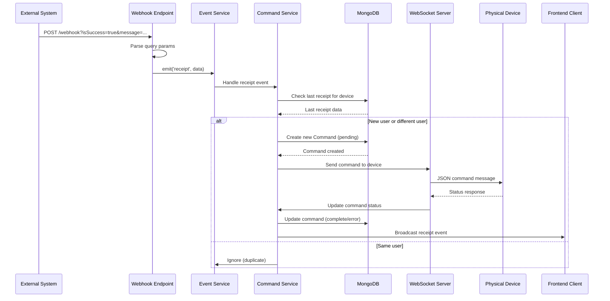
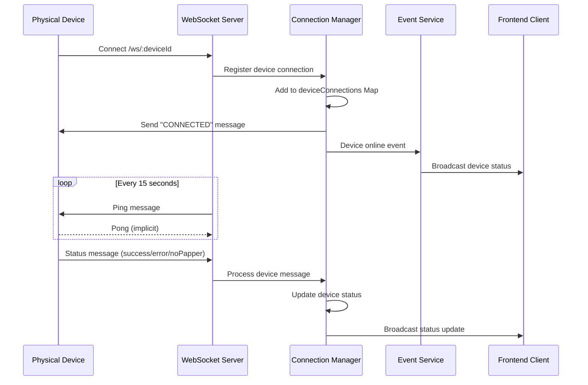
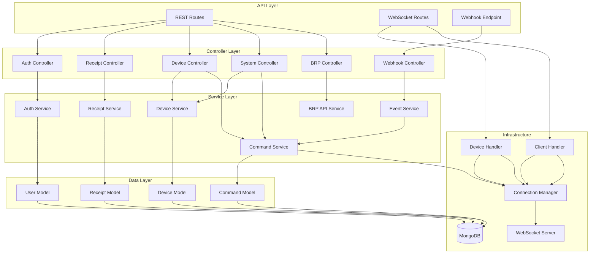
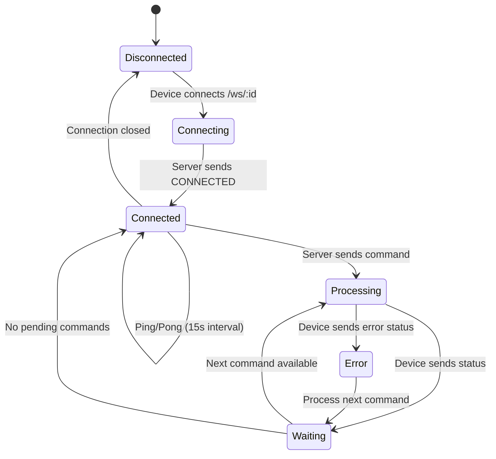

# Receipt System - Architecture Documentation

## Table of Contents

1. [Executive Summary](#executive-summary)
2. [Current System Analysis](#current-system-analysis)
3. [Proposed Architecture](#proposed-architecture)
4. [System Diagrams](#system-diagrams)
5. [Component Architecture](#component-architecture)
6. [Data Flow](#data-flow)
7. [WebSocket Protocol](#websocket-protocol)
8. [API Design](#api-design)
9. [Database Schema](#database-schema)
10. [Security Architecture](#security-architecture)
11. [Frontend Architecture](#frontend-architecture)
12. [Implementation Guide](#implementation-guide)
13. [Pseudo Code Examples](#pseudo-code-examples)

---

## Executive Summary

The Receipt System is a real-time receipt printing and device management platform that:
- Receives webhook events from external systems
- Processes receipt data and commands
- Manages WebSocket connections with physical receipt printers (devices)
- Provides a frontend dashboard for monitoring and querying receipts
- Maintains device online/offline status in real-time

**Technology Stack:**
- **Backend**: Node.js + TypeScript, Express.js, WebSocket (ws package), MongoDB
- **Frontend**: React + TypeScript, WebSocket client, JWT Authentication
- **WebSocket**: Raw WebSocket protocol (ws package) with express-ws for Express integration
- **Build Tool**: Vite (frontend build and bundling)
- **Deployment**: Node.js server serves built frontend static files
- **Protocol**: Custom WebSocket JSON protocol for device communication

---

## Current System Analysis

### Current Architecture Overview

The existing system uses:
- **Express.js** with **express-ws** for WebSocket support
- **MongoDB** with Mongoose for data persistence
- **EventEmitter** pattern for internal event handling
- **Passport.js** with local strategy for authentication
- **Handlebars** for server-side rendering

### Key Components

1. **Webhook Controller**: Receives external webhook calls, parses receipt data
2. **Socket Handler**: Manages device and client WebSocket connections
3. **Event Dispatcher**: Routes events to appropriate handlers
4. **Command Queue**: Stores pending commands for devices
5. **Receipt/Command Models**: MongoDB schemas for data persistence

### Current Data Flow

```
External System → Webhook → Event Emitter → Command Service → WebSocket → Device
                                                      ↓
                                                 MongoDB
```

---

## Proposed Architecture

### High-Level Architecture

```
┌─────────────────────────────────────────────────────────────────┐
│                         Frontend (React)                        │
│  ┌──────────────┐  ┌──────────────┐  ┌──────────────┐         │
│  │   Dashboard  │  │   Receipts   │  │   Devices    │         │
│  └──────┬───────┘  └──────┬───────┘  └──────┬───────┘         │
│         │                 │                  │                  │
│         └─────────────────┼──────────────────┘                  │
│                           │                                     │
│                    ┌──────▼──────┐                             │
│                    │  WebSocket  │                             │
│                    │   Client     │                             │
│                    └──────┬───────┘                             │
└──────────────────────────┼──────────────────────────────────────┘
                           │
┌──────────────────────────▼──────────────────────────────────────┐
│                    Backend API Server                            │
│  ┌──────────────────────────────────────────────────────────┐  │
│  │              Express.js + TypeScript                       │  │
│  │  - Serves Static Files (Vite build from public/)          │  │
│  │  - REST API Routes                                        │  │
│  │  - WebSocket Server                                       │  │
│  └──────────────────────────────────────────────────────────┘  │
│                                                                  │
│  ┌──────────────┐  ┌──────────────┐  ┌──────────────┐       │
│  │   REST API   │  │  WebSocket    │  │   Webhook     │       │
│  │   Routes     │  │   Server      │  │   Handler     │       │
│  │   (/api/*)   │  │   (/ws/*)     │  │   (/webhook)  │       │
│  └──────┬───────┘  └──────┬───────┘  └──────┬───────┘       │
│         │                 │                  │                 │
│  ┌──────▼─────────────────┴──────────────────┴───────┐       │
│  │         Static File Serving (/*)                    │       │
│  │         - Serves Vite-built React SPA              │       │
│  │         - index.html for all non-API routes        │       │
│  └─────────────────────────────────────────────────────┘       │
│                                                                  │
│  ┌──────────────────────────────────────────────────────────┐  │
│         │                 │                  │                 │
│  ┌──────▼─────────────────▼──────────────────▼───────┐        │
│  │              Service Layer                         │        │
│  │  ┌──────────┐ ┌──────────┐ ┌──────────┐         │        │
│  │  │ Receipt  │ │ Command  │ │  Device  │         │        │
│  │  │ Service  │ │ Service  │ │ Service  │         │        │
│  │  └────┬─────┘ └────┬─────┘ └────┬─────┘         │        │
│  │       │            │             │                │        │
│  │  ┌────▼────────────▼────────────▼─────┐          │        │
│  │  │      Event Service (Emitter)        │          │        │
│  │  └─────────────────────────────────────┘          │        │
│  └───────────────────────────────────────────────────┘        │
│                                                                  │
│  ┌──────────────────────────────────────────────────────────┐  │
│  │              Connection Manager                           │  │
│  │  - Device Connections (Map<deviceId, WebSocket>)          │  │
│  │  - Client Connections (Set<WebSocket>)                  │  │
│  │  - Device Status Tracking (Map<deviceId, DeviceStatus>)   │  │
│  │  - Ping Intervals (Map<deviceId, Timeout>)                │  │
│  │  - Message Broadcasting                                  │  │
│  └──────────────────────────────────────────────────────────┘  │
│                                                                  │
│  ┌──────────────────────────────────────────────────────────┐  │
│  │              MongoDB (via Mongoose)                      │  │
│  │  - Receipts Collection                                   │  │
│  │  - Commands Collection                                   │  │
│  │  - Devices Collection                                    │  │
│  │  - Users Collection                                      │  │
│  └──────────────────────────────────────────────────────────┘  │
└──────────────────────────────────────────────────────────────────┘
                           │
┌──────────────────────────▼──────────────────────────────────────┐
│                    Physical Devices                            │
│  ┌──────────┐  ┌──────────┐  ┌──────────┐  ┌──────────┐       │
│  │ Device   │  │ Device   │  │ Device   │  │ Device   │       │
│  │  123     │  │  100     │  │  101     │  │  ...     │       │
│  └──────────┘  └──────────┘  └──────────┘  └──────────┘       │
└─────────────────────────────────────────────────────────────────┘
```

---

## System Diagrams

### Sequence Diagram: Receipt Processing Flow



### Sequence Diagram: Device Connection



### Component Interaction Diagram



---

## Component Architecture

### 1. Webhook Handler

**Purpose**: Receives and processes external webhook calls

**Responsibilities**:
- Validate incoming webhook requests
- Parse query parameters
- Extract receipt data (club, user, membership fee, device)
- Emit receipt events
- IP whitelist validation

**Pseudo Code**:
```typescript
class WebhookController {
  async handleWebhook(req: Request, res: Response) {
    // Validate IP address
    const clientIp = req.headers["x-real-ip"] || req.ip;
    if (!isWhitelisted(clientIp)) {
      return res.status(403).json({ success: false });
    }
    
    // Parse query parameters
    const { isSuccess, message } = req.query;
    
    if (!isSuccess) {
      return res.json({ success: false });
    }
    
    // Parse message: "Club: Bulgaria; Fee: 2.76; User: 12345; Device: 123"
    const params = message.split(';');
    const receiptData = {
      club: extractValue(params[0], 'Club'),
      membershipFee: extractValue(params[2], 'Fee'),
      user: extractValue(params[3], 'User'),
      device: extractValue(params[4]) || getDeviceIdByClub(club),
      ip: clientIp,
      amount: 2.76 // Fixed fee
    };
    
    // Emit event for processing
    eventService.emit('receipt', receiptData);
    
    return res.json({ success: true });
  }
}
```

### 2. WebSocket Connection Manager

**Purpose**: Manages all WebSocket connections (devices and clients)

**Location**: `server/src/managers/ConnectionManager.ts`

**Responsibilities**:
- Track device connections by ID (Map<deviceId, WebSocket>)
- Track client (frontend) connections (Set<WebSocket>)
- Track device status (online/offline, lastSeen, processing status)
- Send messages to specific devices
- Broadcast to all clients
- Monitor connection status
- Handle ping/pong for keepalive (15 second interval)
- Manage ping intervals per device

**Implementation Details**:

The ConnectionManager is implemented as a singleton class with the following structure:

```typescript
class ConnectionManager {
  // Device connections: deviceId -> WebSocket
  private deviceConnections: Map<string, WebSocket> = new Map();
  
  // Client connections: Set of WebSocket instances
  private clientConnections: Set<WebSocket> = new Set();
  
  // Device status tracking: deviceId -> DeviceStatus
  private deviceStatus: Map<string, DeviceStatus> = new Map();
  
  // Ping intervals: deviceId -> NodeJS.Timeout
  private pingIntervals: Map<string, NodeJS.Timeout> = new Map();
  
  // Register device connection
  registerDevice(deviceId: string, ws: WebSocket): void {
    // Remove existing connection if any
    this.removeDevice(deviceId);
    
    // Register new connection
    this.deviceConnections.set(deviceId, ws);
    
    // Update status
    this.deviceStatus.set(deviceId, {
      online: true,
      lastSeen: new Date(),
      status: 'ready',
    });
    
    // Send connection confirmation (string "CONNECTED")
    this.sendToDevice(deviceId, 'CONNECTED');
    
    // Start ping interval (15 seconds)
    this.startPingInterval(deviceId, ws);
    
    // Broadcast device online status to clients
    this.broadcastDeviceStatus(deviceId, true);
  }
  
  // Send message to specific device
  sendToDevice(deviceId: string, message: string | object): boolean {
    const ws = this.deviceConnections.get(deviceId);
    
    if (!ws || ws.readyState !== WebSocket.OPEN) {
      return false;
    }
    
    try {
      const messageStr = typeof message === 'string' ? message : JSON.stringify(message);
      ws.send(messageStr);
      
      // Update last seen
      const status = this.deviceStatus.get(deviceId);
      if (status) {
        this.deviceStatus.set(deviceId, {
          ...status,
          lastSeen: new Date(),
        });
      }
      
      return true;
    } catch (error) {
      this.removeDevice(deviceId);
      return false;
    }
  }
  
  // Broadcast to all frontend clients (or specific client)
  broadcastToClients(message: ClientBroadcastMessage, targetSocket?: WebSocket): void {
    const targets = targetSocket ? [targetSocket] : Array.from(this.clientConnections);
    const messageStr = JSON.stringify(message);
    
    targets.forEach((ws) => {
      if (ws.readyState === WebSocket.OPEN) {
        try {
          ws.send(messageStr);
        } catch (error) {
          this.clientConnections.delete(ws);
        }
      } else {
        this.clientConnections.delete(ws);
      }
    });
  }
  
  // Get online devices
  getOnlineDevices(): string[] {
    return Array.from(this.deviceConnections.keys());
  }
  
  // Remove device connection
  removeDevice(deviceId: string): void {
    const socket = this.deviceConnections.get(deviceId);
    
    if (socket) {
      // Clear ping interval
      const interval = this.pingIntervals.get(deviceId);
      if (interval) {
        clearInterval(interval);
        this.pingIntervals.delete(deviceId);
      }
      
      // Remove connection
      this.deviceConnections.delete(deviceId);
      
      // Update status
      const status = this.deviceStatus.get(deviceId);
      if (status) {
        this.deviceStatus.set(deviceId, {
          ...status,
          online: false,
          lastSeen: new Date(),
        });
      }
      
      // Broadcast device offline status to clients
      this.broadcastDeviceStatus(deviceId, false);
    }
  }
  
  // Start ping interval for device (15 seconds)
  private startPingInterval(deviceId: string, ws: WebSocket): void {
    const interval = setInterval(() => {
      if (ws.readyState === WebSocket.OPEN) {
        this.sendToDevice(deviceId, { Action: 'ping' });
      } else {
        clearInterval(interval);
        this.pingIntervals.delete(deviceId);
        this.removeDevice(deviceId);
      }
    }, 15000); // 15 seconds
    
    this.pingIntervals.set(deviceId, interval);
  }
}
```

**Key Features**:
- **Singleton Pattern**: Single instance exported as `connectionManager`
- **Device Status Tracking**: Tracks online/offline, lastSeen, and processing status (ready/processing/error/noPapper)
- **Ping/Pong Keepalive**: Automatic ping every 15 seconds per device
- **Connection Cleanup**: Automatic cleanup of ping intervals and status on disconnect
- **Broadcast Support**: Can broadcast to all clients or target specific client
- **Type Safety**: Full TypeScript types for all message formats

**Integration**:
- Used by `CommandService` to send commands to devices
- Used by `DeviceService` to check device online status
- Used by `EventService` to broadcast receipt events to clients
- Used by device and client WebSocket handlers for connection management

### 3. WebSocket Handlers

**Purpose**: Handle WebSocket connections for devices and clients

**Location**: `server/src/handlers/`

**Components**:
- **Device Handler** (`device-handler.ts`): Handles device connections at `/ws/:deviceId`
- **Client Handler** (`client-handler.ts`): Handles client connections at `/client`

#### Device Handler

**Responsibilities**:
- Validate device ID against database
- Register device connection with ConnectionManager
- Process pending commands on connect
- Handle device messages (status responses, noPapper alerts)
- Update device status in database
- Handle device disconnection

**Connection Flow**:
1. Device connects to `/ws/:deviceId`
2. Handler validates device exists in database
3. Registers connection with ConnectionManager
4. Updates device status in database
5. Processes pending commands after 1 second delay
6. Sets up message handlers for status responses
7. Handles disconnect and cleanup

**Message Handling**:
- **Status Responses**: Updates command status, processes next pending command
- **No Paper Alerts**: Broadcasts to clients, updates device status
- **Ping**: Updates lastSeen timestamp

#### Client Handler

**Responsibilities**:
- Register client connection with ConnectionManager
- Handle client disconnection
- Send connection confirmation message

**Connection Flow**:
1. Client connects to `/client`
2. Handler registers connection with ConnectionManager
3. ConnectionManager sends confirmation message
4. Handler sets up disconnect handler
5. Client receives real-time updates via ConnectionManager broadcasts

**Note**: Client authentication is optional and can be added later via JWT token validation.

### 4. Command Service

**Purpose**: Manages command queue and processing

**Responsibilities**:
- Create commands from receipt events
- Queue commands for devices
- Process pending commands
- Update command status
- Prevent duplicate receipts for same user

**Pseudo Code**:
```typescript
class CommandService {
  // Create receipt command from event
  async createReceiptCommand(event: ReceiptEvent): Promise<Command> {
    // Validate event data
    if (!event.user || event.user.length < 2 || event.membershipFee <= 0) {
      throw new Error('Invalid receipt data');
    }
    
    // Check for duplicate (same user, same device)
    const lastCommand = await CommandModel.getLastReceipt(event.device);
    
    if (lastCommand && lastCommand.userNumber === event.user) {
      throw new Error('Duplicate receipt for same user');
    }
    
    // Create new command
    const command = new CommandModel({
      commandType: 'receipt',
      deviceId: event.device,
      amount: event.amount,
      membershipFee: event.membershipFee,
      userNumber: event.user,
      location: event.location,
      status: 'pending',
      webhookRequestIp: event.ip
    });
    
    await command.save();
    
    // Trigger processing
    this.processPendingCommands(event.device);
    
    return command;
  }
  
  // Process pending commands for device
  async processPendingCommands(deviceId: string): Promise<void> {
    const pendingCommand = await CommandModel.getPending(deviceId);
    
    if (!pendingCommand) {
      return; // No pending commands
    }
    
    // Format command based on type
    let commandMessage: ServerCommand;
    
    switch (pendingCommand.commandType) {
      case 'receipt':
        commandMessage = {
          MessageId: pendingCommand._id,  // Numeric ID (not string)
          Seq: pendingCommand.clubReceiptN,
          Action: 'print',
          Text: 'Ползване на фитнес и спа',
          Price: pendingCommand.amount
        };
        break;
        
      case 'dailyReport':
        commandMessage = {
          MessageId: pendingCommand._id,  // Numeric ID (not string)
          Action: 'dailyReport'
        };
        break;
        
      case 'monthlyReport':
        commandMessage = {
          MessageId: pendingCommand._id,  // Numeric ID (not string)
          Action: 'report',
          StartDate: formatDate(pendingCommand.startDate),
          EndDate: formatDate(pendingCommand.endDate)
        };
        break;
        
      case 'customCmd':
        commandMessage = {
          Action: 'customcmd',
          MessageId: pendingCommand._id,  // Numeric ID (not string)
          CommandId: pendingCommand.customCmdId,
          Data: pendingCommand.dataCmd
        };
        break;
    }
    
    // Send to device via connection manager
    const sent = connectionManager.sendToDevice(deviceId, commandMessage);
    
    if (!sent) {
      // Device offline, command remains pending
      logger.warn(`Device ${deviceId} offline, command queued`);
    }
  }
  
  // Update command status from device response
  async updateCommandStatus(
    messageId: number,  // Numeric ID (not string)
    status: 'success' | 'error'
  ): Promise<void> {
    const command = await CommandModel.findById(messageId);
    
    if (!command) {
      throw new Error('Command not found');
    }
    
    command.status = status === 'success' ? 'complete' : 'error';
    command.tsProcessed = new Date();
    await command.save();
    
    // Process next pending command
    await this.processPendingCommands(command.deviceId);
  }
}
```

### 5. Event Service

**Purpose**: Centralized event emission and handling

**Responsibilities**:
- Emit events (receipt, daily report, etc.)
- Register event listeners
- Route events to appropriate handlers

**Pseudo Code**:
```typescript
class EventService extends EventEmitter {
  constructor(
    private commandService: CommandService,
    private connectionManager: ConnectionManager
  ) {
    super();
    this.setupEventHandlers();
  }
  
  private setupEventHandlers(): void {
    // Receipt event handler
    this.on('receipt', async (data: ReceiptEvent) => {
      try {
        const command = await this.commandService.createReceiptCommand(data);
        
        // Broadcast to frontend clients (matches receipt format - no type wrapper)
        this.connectionManager.broadcastToClients({
          MessageId: command._id,  // Numeric ID (not string)
          UnicSaleNum: command.clubReceiptN,
          action: 'print',
          price: command.amount,
          user: command.userNumber,
          location: command.location
        });
      } catch (error) {
        logger.error('Error processing receipt event', error);
      }
    });
    
    // Daily report event handler
    this.on('daily', async (data: DailyReportEvent) => {
      const command = await this.commandService.createDailyReportCommand(
        data.device
      );
      // Send to device...
    });
    
    // Period report event handler
    this.on('period', async (data: PeriodReportEvent) => {
      const command = await this.commandService.createPeriodReportCommand(
        data.device,
        data.startDate,
        data.endDate
      );
      // Send to device...
    });
  }
  
  // Public methods for emitting events
  emitReceipt(data: ReceiptEvent): void {
    this.emit('receipt', data);
  }
  
  emitDailyReport(data: DailyReportEvent): void {
    this.emit('daily', data);
  }
  
  emitPeriodReport(data: PeriodReportEvent): void {
    this.emit('period', data);
  }
}
```

### 6. Device Service

**Purpose**: Manages device information and status

**Responsibilities**:
- Track device online/offline status
- Store device metadata (location, name)
- Provide device status queries
- Handle device registration

**Pseudo Code**:
```typescript
class DeviceService {
  // Get all devices with status
  async getAllDevices(): Promise<Device[]> {
    const devices = await DeviceModel.find({});
    const onlineDevices = connectionManager.getOnlineDevices();
    
    return devices.map(device => ({
      ...device.toObject(),
      online: onlineDevices.includes(device.deviceId),
      lastSeen: connectionManager.getDeviceStatus(device.deviceId)?.lastSeen
    }));
  }
  
  // Get device by ID
  async getDeviceById(deviceId: string): Promise<Device | null> {
    const device = await DeviceModel.findOne({ deviceId });
    if (!device) return null;
    
    const isOnline = connectionManager.getOnlineDevices().includes(deviceId);
    
    return {
      ...device.toObject(),
      online: isOnline
    };
  }
  
  // Update device status
  updateDeviceStatus(deviceId: string, status: DeviceStatus): void {
    connectionManager.updateDeviceStatus(deviceId, status);
  }
}
```

### 7. BRP API Service

**Purpose**: Handles authentication and API requests to BRP main API service

**Location**: `server/src/services/BRPApiService.ts`

**Responsibilities**:
- Automatic authentication on server startup
- Token management with expiration handling
- Automatic token refresh before expiration
- Automatic re-authentication on 401 errors
- Make authenticated API calls to BRP main API (e.g., `GET /api/ver3/customers/{id}`)

**Key Features**:
- **Singleton Pattern**: Single instance exported as `brpApiService`
- **Automatic Authentication**: Authenticates automatically when server starts (via `initializeServices()`)
- **Token Management**: Stores authentication token in memory with expiration tracking
- **Automatic Refresh**: Refreshes token before expiration (5-minute buffer)
- **Refresh Token Support**: Uses BRP API refresh token endpoint (`POST /api/ver3/auth/refresh`)
- **Concurrent Request Handling**: Promise-based token refresh to prevent concurrent login attempts
- **401 Error Handling**: Automatically re-authenticates on 401 errors and retries the request

**Token Management**:
- Token stored in memory (singleton service instance)
- Validates token expiration before use
- Automatically refreshes token before expiration (5-minute buffer)
- Handles concurrent requests during token refresh (promise-based locking)
- Falls back to full login if refresh token expires

**Authentication Flow**:
1. Server startup: `initializeServices()` calls `brpApiService.login()`
2. Service authenticates with BRP API using credentials from environment variables
3. Token and refresh token are stored in memory
4. Before each API call, token validity is checked
5. If token is expired or near expiration, automatic refresh is triggered
6. If refresh fails, full login is attempted
7. On 401 errors, token is cleared and re-authentication is performed

**Configuration**:
- Environment variables required:
  - `BRP_API_BASE_URL` - Base URL for BRP main API
  - `BRP_API_KEY` - API key from documentation
  - `BRP_API_USERNAME` - Username for authentication
  - `BRP_API_PASSWORD` - Password for authentication
- Service is optional - server starts even if BRP API is not configured

**Pseudo Code**:
```typescript
class BRPApiService {
  private token: BRPAuthToken | null = null;
  private refreshPromise: Promise<void> | null = null;

  // Login to BRP API
  async login(): Promise<void> {
    const response = await fetch(`${baseURL}/api/ver3/auth/login`, {
      method: 'POST',
      body: JSON.stringify({ username, password })
    });
    const data = await response.json();
    this.updateTokenFromResponse(data);
  }

  // Get valid authentication token, refreshing if needed
  async getAuthToken(): Promise<string> {
    if (this.token && this.isTokenValid(this.token)) {
      return this.token.token;
    }
    
    // Prevent concurrent refreshes
    if (this.refreshPromise) {
      await this.refreshPromise;
    }
    
    // Refresh or re-login
    this.refreshPromise = this.refreshOrLogin();
    await this.refreshPromise;
    this.refreshPromise = null;
    
    return this.token!.token;
  }

  // Make authenticated request with automatic retry on 401
  private async makeAuthenticatedRequest<T>(endpoint: string): Promise<T> {
    const token = await this.getAuthToken();
    const response = await fetch(`${baseURL}${endpoint}`, {
      headers: { Authorization: `Bearer ${token}` }
    });
    
    // Handle 401 - refresh and retry
    if (response.status === 401) {
      this.token = null;
      const newToken = await this.getAuthToken();
      // Retry request with new token
      return this.makeAuthenticatedRequest<T>(endpoint);
    }
    
    return response.json();
  }

  // Get customer by ID
  async getCustomerById(id: string | number): Promise<BRPCustomer> {
    return this.makeAuthenticatedRequest<BRPCustomer>(`/api/ver3/customers/${id}`);
  }
}
```

**Integration**:
- Called by `BRPController` for HTTP endpoints
- Initialized automatically on server startup via `initializeServices()`
- Uses same logging and error handling patterns as other services
- Follows service layer pattern - no direct HTTP dependencies

---

## Data Flow

### Receipt Processing Flow

```
1. External System → Webhook Endpoint
   ├─ Query params: isSuccess=true, message="Club: X; Fee: Y; User: Z"
   └─ IP validation check

2. Webhook Controller
   ├─ Parse message string
   ├─ Extract: club, membershipFee, user, device
   └─ Emit 'receipt' event with data

3. Event Service
   └─ Route to receipt handler

4. Command Service
   ├─ Check last receipt for device
   ├─ Validate (not duplicate user)
   ├─ Create Command document (status: pending)
   └─ Trigger processPendingCommands()

5. Command Processing
   ├─ Query pending command for device
   ├─ Format command message (JSON)
   └─ Send via Connection Manager

6. Connection Manager
   ├─ Lookup device WebSocket
   ├─ Send JSON message
   └─ Broadcast to frontend clients

7. Physical Device
   ├─ Receive command
   ├─ Process print command
   └─ Send status response

8. Device Response Handler
   ├─ Parse device message
   ├─ Update command status (complete/error)
   └─ Process next pending command
```

### Device Connection Flow

```
1. Device connects → /ws/:deviceId
   ├─ Device Handler receives connection
   ├─ Extract deviceId from URL parameter
   └─ Validate device exists in database

2. Connection Manager Registration
   ├─ Register device in Map<deviceId, WebSocket>
   ├─ Set status: online, ready
   ├─ Send "CONNECTED" string message
   ├─ Start ping interval (15s)
   └─ Broadcast device online status to clients

3. Device Service Update
   ├─ Update device status in database (online: true)
   └─ Update lastSeen timestamp

4. Process Pending Commands
   ├─ Wait 1 second (allow connection to stabilize)
   ├─ Query pending commands for device
   ├─ If found, send via ConnectionManager
   └─ Otherwise, wait for new commands

5. Keepalive (Ping/Pong)
   ├─ Every 15s: ConnectionManager sends ping
   ├─ Device connection maintained (implicit pong)
   ├─ Update lastSeen on ping
   └─ If connection closed, mark offline

6. Device Disconnection
   ├─ Device Handler receives close event
   ├─ ConnectionManager removes device
   ├─ Clear ping interval
   ├─ Update device status in database (online: false)
   └─ Broadcast device offline status to clients
```

---

## WebSocket Protocol

### Protocol Specification

The system uses a custom JSON-based protocol over WebSocket for device communication. The implementation uses the `ws` package (raw WebSocket) with `express-ws` for Express integration, matching device expectations for raw WebSocket protocol (not Socket.IO).

**WebSocket Endpoints**:
- **Device Connections**: `WS /ws/:deviceId` - Handled by `device-handler.ts`
- **Client Connections**: `WS /client` - Handled by `client-handler.ts`

**Connection Management**:
- All connections managed by `ConnectionManager` singleton
- Device connections tracked in `Map<deviceId, WebSocket>`
- Client connections tracked in `Set<WebSocket>`
- Automatic ping/pong keepalive (15 second interval)

### Message Types

#### 1. Server → Device Messages

**Print Receipt Command**:
```json
{
  "MessageId": 12345,
  "Seq": "1234",
  "Action": "print",
  "Text": "Ползване на фитнес и спа",
  "Price": "2.76"
}
```

**Daily Report Command**:
```json
{
  "MessageId": 12346,
  "Action": "dailyReport"
}
```

**Period Report Command**:
```json
{
  "MessageId": 12347,
  "Action": "report",
  "StartDate": "010219",
  "EndDate": "280219"
}
```

**Custom Command**:
```json
{
  "Action": "customcmd",
  "MessageId": 12348,
  "CommandId": "2A",
  "Data": "C0C1C2C3"
}
```

**Ping**:
```json
{
  "Action": "ping"
}
```

**Connection Confirmation**:
```json
"CONNECTED"
```

#### 2. Device → Server Messages

**Status Response (Success)**:
```json
{
  "MessageId": 12345,
  "Status": "success"
}
```

**Status Response (Error)**:
```json
{
  "MessageId": 12345,
  "Status": "error",
  "MsgData": "Error description",
  "MsgStatus": "Error code"
}
```

**No Paper Status**:
```json
{
  "Status": "noPapper"
}
```

**Ping Response** (implicit, no message sent)

### TypeScript Type Definitions

```typescript
// Server to Device
interface ServerCommand {
  MessageId: number;       // Numeric command ID (auto-incremented, not ObjectId string)
  Action: 'print' | 'dailyReport' | 'report' | 'customcmd';
  Seq?: string;           // Receipt sequence number (for print) - stored as string in MongoDB
  Text?: string;          // Receipt text (for print)
  Price?: string;         // Receipt amount (for print) - stored as string in MongoDB
  StartDate?: string;     // Format: DDMMYY (for report)
  EndDate?: string;       // Format: DDMMYY (for report)
  CommandId?: string;     // Custom command ID (for customcmd)
  Data?: string;         // Custom command data (for customcmd)
}

interface PingMessage {
  Action: 'ping';
}

// Device to Server
interface DeviceMessage {
  MessageId?: number;     // Numeric command ID (not ObjectId string)
  Action?: 'ping';
  Status?: 'success' | 'error' | 'noPapper';
  MsgData?: string;
  MsgStatus?: string;
}

// Frontend Client Messages
// Note: Receipt events are sent directly without a type wrapper (matches receipt)
// Other messages (connect, noPapper, info) include a type field
type ClientMessage = 
  | {
      MessageId: string;
      UnicSaleNum: string;
      action: 'print';
      price: string;
      user: string;
      location: string;
    }
  | {
      type: 'info';
      message: string;
    }
  | {
      type: 'connect' | 'noPapper';
      location: Location;
    };
```

### Protocol State Machine



---

## API Design

### REST API Endpoints

#### Authentication

```
POST   /api/auth/login
Body: { username: string, password: string }
Response: { token: string, user: User }

POST   /api/auth/refresh
Headers: { Authorization: "Bearer <token>" }
Response: { token: string }

POST   /api/auth/logout
Headers: { Authorization: "Bearer <token>" }
```

#### Receipts

```
GET    /api/receipts
Query: ?deviceId=123&startDate=2024-01-01&endDate=2024-01-31&limit=50&offset=0
Headers: { Authorization: "Bearer <token>" }
Response: { receipts: Receipt[], total: number }

GET    /api/receipts/:id
Headers: { Authorization: "Bearer <token>" }
Response: { receipt: Receipt }

GET    /api/receipts/export
Query: ?startDate=...&endDate=...&deviceId?&customerNumber?&format?
Headers: { Authorization: "Bearer <token>" }
Response: Excel file download (streamed; no temp files)
```

#### Devices

```
GET    /api/devices
Headers: { Authorization: "Bearer <token>" }
Response: { devices: Device[] }

GET    /api/devices/:id
Headers: { Authorization: "Bearer <token>" }
Response: { device: Device }

GET    /api/devices/:id/status
Headers: { Authorization: "Bearer <token>" }
Response: { online: boolean, lastSeen: Date }

POST   /api/devices/:id/command
Body: { type: 'daily' | 'period' | 'cmd' | 'daily-X' | 'spad-naprejenie', startDate?, endDate?, commandId?, data? }
Headers: { Authorization: "Bearer <token>" } (Admin role required)
Response: { commandId: string, deviceId: string, type: string, status: string, createdAt: string }
```

#### System

```
GET    /api/system/status
Headers: { Authorization: "Bearer <token>" }
Response: { status: string, uptime: number, version: string, database: {...}, devices: {...}, commands: {...} }

GET    /api/system/debug
Headers: { Authorization: "Bearer <token>" } (Super role required)
Response: { sockets: [...], connections: {...} }

POST   /api/system/restart
Headers: { Authorization: "Bearer <token>" } (Super role required)
Response: { message: string }

GET    /api/system/debug/socket/:socketId
Headers: { Authorization: "Bearer <token>" } (Super role required)
Response: { message: string, socketId: string }
```

#### Webhooks

```
GET    /webhook
Query: ?isSuccess=true&message=...
Response: { success: boolean }

Note: Report types (daily, period, cmd, daily-X, spad-naprejenie) are NOT handled via webhook.
All report types are triggered by the client (frontend) via POST /api/devices/:id/command.
```

### WebSocket Endpoints

```
WS     /ws/:deviceId
       Device connection endpoint
       Messages: ServerCommand, DeviceMessage

WS     /client
       Frontend client connection endpoint
       Messages: ClientMessage
```

### API Response Format

**Success Response**:
```json
{
  "success": true,
  "data": { ... },
  "meta": {
    "timestamp": "2024-01-15T10:30:00Z",
    "requestId": "req_123456789"
  }
}
```

**Error Response**:
```json
{
  "success": false,
  "error": {
    "code": "ERROR_CODE",
    "message": "Human readable error message",
    "details": { ... }
  },
  "meta": {
    "timestamp": "2024-01-15T10:30:00Z",
    "requestId": "req_123456789"
  }
}
```

---

## Database Schema

### Receipt Model

```typescript
interface Receipt {
  _id: ObjectId;
  device: string;              // Device ID (e.g., "123")
  amount: string;              // Receipt amount
  MembershipFee: string;       // Membership fee
  userNumber: string;          // User identifier
  location: string;            // Location name
  ip: string;                  // Webhook request IP
  Status: 'pending' | 'processed';
  ts: Date;                    // Timestamp
}
```

### Command Model

```typescript
interface Command {
  _id: number;                 // Auto-incremented numeric ID (not ObjectId)
  commandType: 'receipt' | 'dailyReport' | 'monthlyReport' | 'customCmd';
  deviceId: string;
  userNumber?: string;         // For receipt commands
  status: 'pending' | 'complete' | 'error';
  amount?: string;             // For receipt commands
  membershipFee?: string;      // For receipt commands
  location?: string;
  webhookRequestIp?: string;
  clubReceiptN?: number;       // Receipt sequence number
  startDate?: Date;            // For period reports
  endDate?: Date;              // For period reports
  adminId?: ObjectId;          // Admin who triggered command
  customCmdId?: string;        // For custom commands
  dataCmd?: string;            // For custom commands
  tsProcessed?: Date;          // When command was completed
  ts: Date;                    // Creation timestamp
}
```

**Note:** Command `_id` is an auto-incremented number, not a MongoDB ObjectId. The Counter model (see below) manages the sequence generation using MongoDB's atomic operations.

### Counter Model

**Purpose:** Manages auto-increment sequences for numeric IDs

**Location:** `server/src/models/Counter.ts`

```typescript
interface Counter {
  _id: string;                 // Sequence name (e.g., "commandId")
  seq: number;                 // Current sequence value
}

interface ICounterDocument extends Document {
  _id: string;
  seq: number;
}

interface ICounterModel extends Model<ICounterDocument> {
  getNextSequence(sequenceName: string): Promise<number>;
}
```

**Usage:**
- Used by Command model to generate auto-incremented numeric `_id` values
- Provides atomic sequence generation using MongoDB's `findOneAndUpdate` with `upsert`
- Sequence name: `"commandId"` for Command model

**Example:**
```typescript
const nextId = await Counter.getNextSequence('commandId');
// Returns: 1, 2, 3, ... (increments atomically)
```

### Device Model

```typescript
interface Device {
  _id: ObjectId;
  deviceId: string;           // Unique device identifier
  name: string;                // Device/location name
  location: string;            // Physical location
  status: boolean;             // Online/offline (cached)
  lastSeen?: Date;             // Last connection time
  metadata?: {
    firmwareVersion?: string;
    model?: string;
  };
  createdAt: Date;
  updatedAt: Date;
}
```

### User Model

```typescript
interface User {
  _id: ObjectId;
  email: string;              // Unique
  username: string;            // Unique
  salt: string;                // Password salt
  hashedPass: string;          // Hashed password
  roles: string[];             // ['Admin', 'Super']
  createdAt: Date;
  updatedAt: Date;
}
```

### BRP User Model

`BRPUser` links a BRP customer to their receipts and tracks the Pulse Club **voucher** counter and
**subscription** lifecycle (grant, per-entry decrement, renewal rollover, and per-plan leftovers).

```typescript
interface IBRPUser {
  _id: ObjectId;
  brpId: number;                  // BRP person ID (unique)
  firstName: string;
  lastName: string;
  customerNumber: string;
  amount: number;                 // spendable vouchers remaining (current cycle)
  initialAmount: number;          // vouchers granted for the current cycle
  subscriptionStartDate?: Date;   // current plan start
  subscriptionBoundUntil?: Date;  // current plan boundUntil (drives renewal detection)
  subscriptionId?: number;        // current plan id (attribution)
  subscriptionName?: string;      // current plan product name (attribution)
  leftovers?: IBRPLeftover[];     // per-plan archive of unused vouchers (not spendable)
  tsCreated: Date;
}
```

> Full behavior — gating, grant derivation, renewal/rollover rules, edge cases, and backfill — is
> documented in [`USER_RECEIPTS_AND_SUBSCRIPTIONS.md`](./USER_RECEIPTS_AND_SUBSCRIPTIONS.md).

### Database Indexes

```typescript
// Receipt indexes
Receipt.index({ device: 1, ts: -1 });
Receipt.index({ Status: 1, device: 1 });
Receipt.index({ ts: -1 });

// Command indexes
Command.index({ deviceId: 1, status: 1, ts: 1 });
Command.index({ commandType: 1, ts: -1 });
Command.index({ ts: -1 });

// Device indexes
Device.index({ deviceId: 1 }, { unique: true });

// User indexes
User.index({ email: 1 }, { unique: true });
User.index({ username: 1 }, { unique: true });
```

---

## Middleware Architecture

### Request Processing Pipeline

The Express application uses middleware in the following order:

1. **CORS Middleware** - Handles cross-origin requests
2. **Body Parsers** - Parses JSON and URL-encoded request bodies
3. **Request ID Middleware** - Adds unique request ID to each request
4. **Request Logging** - Logs all incoming requests
5. **API Routes** - Handles `/api/*` routes
6. **Webhook Routes** - Handles `/webhook` routes
7. **Static File Serving** - Serves frontend build files
8. **Error Handler** - Catches and formats errors

### Authentication Middleware

**Location**: `server/src/middleware/auth.ts`

**JWT Authentication Middleware** (`authenticate`):
- Validates JWT token from `Authorization: Bearer {token}` header
- Extracts user information from token
- Attaches user object to request (`req.user`)
- Returns `401 Unauthorized` if token is missing or invalid

**Role-Based Authorization Middleware** (`authorize`):
- Checks if user has required role(s)
- Used for protecting Admin/Super endpoints
- Returns `403 Forbidden` if user lacks required permissions
- Supports multiple roles: `authorize('Admin', 'Super')`

### Validation Middleware

**Location**: `server/src/middleware/validation.ts`

**Validation Factory** (`validate`):
- Validates request body, query parameters, and URL parameters
- Uses validator functions that return `true` on success or error message string on failure
- Returns `422 Unprocessable Entity` with validation error details

**Common Validators**:
- `required` - Field must be present and non-empty
- `string` - Value must be a string
- `number` - Value must be a number
- `email` - Value must be a valid email address
- `minLength(min)` - String must be at least `min` characters
- `date` - Value must be a valid ISO 8601 date
- `oneOf(allowed)` - Value must be one of the allowed values
- `boolean` - Value must be a boolean

### IP Whitelist Utility

**Location**: `server/src/utils/ip-whitelist.ts`

**Purpose**: Validates webhook requests against IP whitelist

**Functions**:
- `getWhitelistedIPs()` - Returns list of whitelisted IP addresses
- `isIPWhitelisted(ip)` - Checks if IP is whitelisted
- `getClientIP(req)` - Extracts client IP from request (handles proxy headers)

**Configuration**: IPs stored in `WEBHOOK_IPS` environment variable (comma-separated)

### API Response Helpers

**Location**: `server/src/utils/api-response.ts`

**Success Response Helper** (`sendSuccess`):
- Formats standardized success response
- Includes data, timestamp, and request ID
- Sets HTTP status code (default: 200)

**Error Response Helper** (`sendError`):
- Formats standardized error response
- Includes error code, message, optional details, timestamp, and request ID
- Sets appropriate HTTP status code

**Request ID Middleware** (`requestIdMiddleware`):
- Generates unique UUID for each request
- Adds `X-Request-ID` header to response
- Attaches request ID to request object for logging

---

## Security Architecture

### Authentication & Authorization

**JWT Token Structure**:
```typescript
interface JWTPayload {
  userId: string;
  username: string;
  roles: string[];
  iat: number;      // Issued at
  exp: number;      // Expiration
}
```

**Token Flow**:
```
1. User logs in → POST /api/auth/login
2. Server validates credentials
3. Server generates JWT (expires in 24h)
4. Client stores token (localStorage/sessionStorage)
5. Client sends token in Authorization header
6. Server validates token on each request
7. Token refresh before expiration
```

### Webhook Security

**IP Whitelist**:
```typescript
const WHITELISTED_IPS = [
  '213.91.159.250',
  '87.121.163.64',
  // ... other IPs
];

function validateWebhookIP(ip: string): boolean {
  return WHITELISTED_IPS.includes(ip);
}
```

### WebSocket Security

**Device Authentication**:
- Device ID in URL path (`/ws/:deviceId`)
- Validate device ID exists in database
- Track connection attempts
- Rate limiting per device

**Client Authentication**:
- JWT token in connection query: `/client?token=...`
- Validate token before accepting connection
- Close connection if token invalid/expired

### Data Validation

**Input Validation**:
- Validate all webhook parameters
- Sanitize user inputs
- Type checking with TypeScript
- Schema validation with class-validator

**Output Sanitization**:
- Remove sensitive data from responses
- Mask IP addresses in logs
- Limit data exposure in error messages

---

## Frontend Architecture

### Build Tool: Vite

The frontend uses **Vite** as the build tool for fast development and optimized production builds.

**Key Features:**
- Fast HMR (Hot Module Replacement) in development
- Optimized production builds with code splitting
- TypeScript support out of the box
- Environment variables via `import.meta.env.VITE_*`
- Asset optimization and hashing

**Build Output:**
- Production build creates `dist/` directory
- Static assets (JS, CSS, images) are hashed for cache busting
- `index.html` serves as the entry point for the SPA

### Component Structure

```
frontend/
├── src/
│   ├── components/
│   │   ├── common/
│   │   │   ├── Header.tsx
│   │   │   ├── Sidebar.tsx
│   │   │   ├── Loading.tsx
│   │   │   └── ErrorBoundary.tsx
│   │   ├── receipts/
│   │   │   ├── ReceiptList.tsx
│   │   │   ├── ReceiptCard.tsx
│   │   │   └── ReceiptFilters.tsx
│   │   └── devices/
│   │       ├── DeviceList.tsx
│   │       ├── DeviceCard.tsx
│   │       └── DeviceStatus.tsx
│   ├── pages/
│   │   ├── Login.tsx
│   │   ├── Dashboard.tsx
│   │   ├── Receipts.tsx
│   │   └── Devices.tsx
│   ├── services/
│   │   ├── api.service.ts
│   │   ├── auth.service.ts
│   │   ├── websocket.service.ts
│   │   └── receipt.service.ts
│   ├── hooks/
│   │   ├── useAuth.ts
│   │   ├── useWebSocket.ts
│   │   └── useReceipts.ts
│   ├── store/
│   │   ├── auth.slice.ts
│   │   ├── devices.slice.ts
│   │   └── receipts.slice.ts
│   ├── utils/
│   │   ├── token.ts
│   │   └── date.ts
│   ├── main.tsx
│   └── App.tsx
├── public/              # Static assets (images, favicon, etc.)
├── dist/                # Vite build output (deployed to server/public/)
├── vite.config.ts       # Vite configuration
└── package.json
```

### State Management

**Redux Toolkit Slices**:

```typescript
// auth.slice.ts
interface AuthState {
  user: User | null;
  token: string | null;
  isAuthenticated: boolean;
}

// devices.slice.ts
interface DevicesState {
  devices: Device[];
  onlineDevices: string[];
  selectedDevice: string | null;
}

// receipts.slice.ts
interface ReceiptsState {
  receipts: Receipt[];
  filters: ReceiptFilters;
  loading: boolean;
  total: number;
}
```

### WebSocket Client Integration

```typescript
class WebSocketService {
  private socket: Socket | null = null;
  
  connect(token: string): void {
    this.socket = io('/client', {
      auth: { token },
      transports: ['websocket']
    });
    
    this.socket.on('connect', () => {
      console.log('Connected to WebSocket');
    });
    
    this.socket.on('receipt', (data) => {
      store.dispatch(addReceipt(data));
    });
    
    this.socket.on('device_status', (data) => {
      store.dispatch(updateDeviceStatus(data));
    });
  }
  
  disconnect(): void {
    if (this.socket) {
      this.socket.disconnect();
      this.socket = null;
    }
  }
}
```

### Routing

```typescript
<Routes>
  <Route path="/login" element={<Login />} />
  <Route element={<ProtectedRoute />}>
    <Route path="/" element={<Dashboard />} />
    <Route path="/receipts" element={<Receipts />} />
    <Route path="/devices" element={<Devices />} />
  </Route>
</Routes>
```

---

## Implementation Guide

### Development Setup

Before starting implementation, set up the development environment:

```bash
# Install root dependencies
npm install -D concurrently chokidar-cli

# Install frontend dependencies
cd frontend
npm install
npm install -D vite @vitejs/plugin-react

# Install backend dependencies
cd ../server
npm install
npm install -D ts-node-dev typescript @types/node @types/express
```

**Start Development:**
```bash
# From project root
npm run dev

# This will:
# - Start frontend in watch mode (auto-rebuild on change)
# - Start backend in watch mode (auto-restart on change)
# - Copy frontend builds to server/public/ automatically
```

### Phase 1: Backend Foundation

1. **Project Setup**
   ```bash
   mkdir receipt-ts
   cd receipt-ts
   npm init -y
   npm install express ws express-ws mongoose jsonwebtoken
   npm install -D typescript @types/node @types/express ts-node concurrently chokidar-cli
   ```

2. **TypeScript Configuration**
   ```json
   {
     "compilerOptions": {
       "target": "ES2020",
       "module": "commonjs",
       "lib": ["ES2020"],
       "outDir": "./dist",
       "rootDir": "./src",
       "strict": true,
       "esModuleInterop": true,
       "skipLibCheck": true,
       "forceConsistentCasingInFileNames": true
     }
   }
   ```

3. **Project Structure Setup**
   - Create directory structure
   - Setup MongoDB connection
   - Create base Express app
   - Setup WebSocket server

### Phase 2: Core Services

1. **Database Models**
   - Implement Receipt, Command, Device, User models
   - Add indexes
   - Create migration scripts

2. **Service Layer**
   - Implement EventService
   - Implement CommandService
   - Implement ReceiptService
   - Implement DeviceService

3. **Connection Manager**
   - Implement WebSocket connection tracking
   - Add ping/pong mechanism
   - Implement message routing

### Phase 3: API & Webhooks

1. **REST API**
   - Implement authentication endpoints
   - Implement receipts endpoints
   - Implement devices endpoints
   - Add JWT middleware

2. **Webhook Handler**
   - Implement webhook endpoint
   - Add IP validation
   - Parse and emit events

3. **WebSocket Handlers**
   - Device connection handler
   - Client connection handler
   - Message processing

### Phase 4: Frontend

1. **React Setup with Vite**
   - Create React app with Vite and TypeScript
   - Configure Vite for production builds
   - Setup routing
   - Setup state management

2. **Authentication**
   - Login page
   - JWT token management
   - Protected routes

3. **Dashboard**
   - Device status monitoring
   - Real-time updates
   - Receipt querying interface

4. **Build Configuration**
   - Configure Vite build output
   - Setup environment variables (VITE_*)
   - Configure asset optimization

### Phase 5: Testing & Deployment

1. **Testing**
   - Unit tests for services
   - Integration tests for API
   - WebSocket connection tests

2. **Deployment**
   - Build frontend with Vite (`npm run build`)
   - Build backend TypeScript (`npm run build`)
   - Copy frontend dist to server public directory
   - Configure Express to serve static files
   - Docker configuration
   - Environment variables
   - Production build and deployment scripts

---

## Pseudo Code Examples

### Complete Receipt Processing Flow

```typescript
// 1. Webhook receives request
app.get('/webhook', async (req, res) => {
  const ip = req.headers["x-real-ip"] || req.ip;
  
  // Validate IP
  if (!isWhitelisted(ip)) {
    return res.status(403).json({ success: false });
  }
  
  // Parse query
  const { isSuccess, message } = req.query;
  if (!isSuccess) {
    return res.json({ success: false });
  }
  
  // Extract data
  const params = message.split(';');
  const receiptData = {
    club: extractValue(params[0], 'Club'),
    membershipFee: parseFloat(extractValue(params[2], 'Fee')),
    user: extractValue(params[3], 'User'),
    device: extractValue(params[4]) || getDeviceIdByClub(club),
    ip: ip,
    amount: 2.76
  };
  
  // Validate
  if (!receiptData.user || receiptData.user.length < 2 || 
      receiptData.membershipFee <= 0) {
    logger.info('Employee or invalid receipt', receiptData);
    return res.json({ success: true }); // Still return success
  }
  
  // Emit event
  eventService.emitReceipt(receiptData);
  
  return res.json({ success: true });
});

// 2. Event handler processes receipt
eventService.on('receipt', async (data) => {
  try {
    // Check for duplicate
    const lastCommand = await CommandModel.getLastReceipt(data.device);
    
    if (lastCommand && lastCommand.userNumber === data.user) {
      logger.info('Duplicate receipt for same user', data);
      return;
    }
    
    // Create command
    const command = new CommandModel({
      commandType: 'receipt',
      deviceId: data.device,
      amount: data.amount.toString(),
      membershipFee: data.membershipFee.toString(),
      userNumber: data.user,
      location: data.location,
      status: 'pending',
      webhookRequestIp: data.ip
    });
    
    await command.save();
    
    // Process command
    await commandService.processPendingCommands(data.device);
    
    // Broadcast to clients (matches receipt format - no type wrapper)
    connectionManager.broadcastToClients({
      MessageId: command._id,  // Numeric ID (not string)
      UnicSaleNum: command.clubReceiptN,
      action: 'print',
      price: command.amount,
      user: command.userNumber,
      location: command.location
    });
    
  } catch (error) {
    logger.error('Error processing receipt', error);
  }
});

// 3. Command processing
async function processPendingCommands(deviceId: string) {
  const pendingCommand = await CommandModel.getPending(deviceId);
  
  if (!pendingCommand) return;
  
  // Format command
  const commandMessage: ServerCommand = {
    MessageId: pendingCommand._id,  // Numeric ID (not string)
    Seq: pendingCommand.clubReceiptN,
    Action: 'print',
    Text: 'Ползване на фитнес и спа',
    Price: parseFloat(pendingCommand.amount)
  };
  
  // Send to device
  const sent = connectionManager.sendToDevice(
    deviceId, 
    JSON.stringify(commandMessage)
  );
  
  if (!sent) {
    logger.warn(`Device ${deviceId} offline, command queued`);
  }
}

// 4. Device responds
ws.on('message', (message: string) => {
  const msg: DeviceMessage = JSON.parse(message);
  
  if (msg.MessageId && msg.Status) {
    if (msg.Status === 'success') {
      commandService.updateCommandStatus(msg.MessageId, 'success');
    } else if (msg.Status === 'error') {
      commandService.updateCommandStatus(msg.MessageId, 'error');
      logger.error(`Command ${msg.MessageId} failed: ${msg.MsgData}`);
    }
    
    // Process next command
    commandService.processPendingCommands(deviceId);
  } else if (msg.Status === 'noPapper') {
    connectionManager.broadcastToClients({
      type: 'noPapper',
      deviceId: deviceId
    });
  }
});
```

### Device Connection Management

```typescript
// Device connects
app.ws('/ws/:deviceId', (ws, req) => {
  const deviceId = req.params.deviceId;
  
  // Validate device exists
  const device = await DeviceModel.findOne({ deviceId });
  if (!device) {
    ws.close(1008, 'Invalid device ID');
    return;
  }
  
  // Register connection
  connectionManager.registerDevice(deviceId, ws);
  
  // Send confirmation
  ws.send(JSON.stringify('CONNECTED'));
  
  // Start ping interval
  const pingInterval = setInterval(() => {
    if (ws.readyState === WebSocket.OPEN) {
      ws.send(JSON.stringify({ Action: 'ping' }));
    } else {
      clearInterval(pingInterval);
    }
  }, 15000);
  
  // Handle messages
  ws.on('message', (message: string) => {
    try {
      const msg: DeviceMessage = JSON.parse(message);
      handleDeviceMessage(deviceId, msg);
    } catch (error) {
      logger.error('Invalid message from device', error);
    }
  });
  
  // Handle disconnect
  ws.on('close', () => {
    clearInterval(pingInterval);
    connectionManager.removeDevice(deviceId);
  });
  
  // Process pending commands
  setTimeout(() => {
    commandService.processPendingCommands(deviceId);
  }, 1000);
});
```

### Frontend Real-time Updates

```typescript
// React hook for WebSocket
function useWebSocket() {
  const dispatch = useAppDispatch();
  const token = useAppSelector(state => state.auth.token);
  
  useEffect(() => {
    if (!token) return;
    
    const socket = io('/client', {
      auth: { token },
      transports: ['websocket']
    });
    
    socket.on('connect', () => {
      console.log('Connected');
    });
    
    socket.on('receipt', (data) => {
      dispatch(addReceipt(data));
      // Show notification
      toast.success(`New receipt from ${data.location}`);
    });
    
    socket.on('device_status', (data) => {
      dispatch(updateDeviceStatus({
        deviceId: data.deviceId,
        online: data.status === 'online'
      }));
    });
    
    socket.on('noPapper', (data) => {
      toast.warning(`Device ${data.deviceId} has no paper`);
    });
    
    return () => {
      socket.disconnect();
    };
  }, [token, dispatch]);
}
```

---

## Deployment Architecture

### Production Setup

The application uses a simple deployment model where the Node.js server serves both the API and the built frontend static files.

```
┌─────────────────────────────────────────┐
│         Load Balancer (Nginx)           │
│         (Optional - for SSL/Proxy)       │
└──────────────┬──────────────────────────┘
               │
    ┌──────────┴──────────┐
    │                     │
┌───▼────┐          ┌─────▼───┐
│ Node.js│          │ Node.js │
│ Server │          │ Server  │
│        │          │         │
│ ┌──────┴──────┐  │         │
│ │ Express API │  │         │
│ │ WebSocket   │  │         │
│ │ Static Files│  │         │
│ │ (Vite build)│  │         │
│ └─────────────┘  │         │
└───┬────┘          └─────┬───┘
    │                     │
    └──────────┬──────────┘
               │
        ┌──────▼──────┐
        │   MongoDB   │
        │  (Replica   │
        │    Set)     │
        └─────────────┘
```

### Build and Deployment Flow

```
1. Frontend Build (Vite)
   └─> npm run build (in frontend directory)
   └─> Output: dist/ directory with static assets

2. Backend Build (TypeScript)
   └─> npm run build (in server directory)
   └─> Output: dist/ directory with compiled JS

3. Deployment
   └─> Copy frontend dist/ to server/public/
   └─> Copy backend dist/ to server/dist/
   └─> Start Node.js server
   └─> Express serves static files from public/
   └─> Express serves API from routes
```

### Static File Serving

The Node.js Express server serves the Vite-built frontend from the `public/` directory. The server acts as both API server and static file server.

**Express Server Setup:**

```typescript
import express from 'express';
import path from 'path';
import { fileURLToPath } from 'url';

const __filename = fileURLToPath(import.meta.url);
const __dirname = path.dirname(__filename);

const app = express();

// Middleware
app.use(express.json());
app.use(express.urlencoded({ extended: true }));

// Serve static files from Vite build (CSS, JS, images, etc.)
app.use(express.static(path.join(__dirname, '../public'), {
  maxAge: '1y', // Cache static assets for 1 year
  etag: true,
  lastModified: true
}));

// API routes (must be before catch-all)
app.use('/api', apiRoutes);

// WebSocket routes (handled by express-ws)
// express-ws adds WebSocket support to Express routes

// Webhook routes
app.get('/webhook', webhookHandler);
app.post('/webhook/report', webhookReportHandler);

// Catch-all: serve React SPA for all non-API routes
// This allows React Router to handle client-side routing
app.get('*', (req, res) => {
  // Skip API and WebSocket routes
  if (req.path.startsWith('/api') || req.path.startsWith('/ws')) {
    return res.status(404).json({ error: 'Not found' });
  }
  
  res.sendFile(path.join(__dirname, '../public/index.html'));
});
```

**Route Priority:**
1. Static assets (JS, CSS, images) - served from `public/` directory
2. API routes (`/api/*`) - handled by Express routes
3. WebSocket routes (`/ws/*`, `/client`) - handled by express-ws
4. Webhook routes (`/webhook`) - handled by Express routes
5. All other routes - serve `index.html` for React Router

**This ensures:**
- API routes (`/api/*`) are handled by Express
- WebSocket routes (`/ws/*`, `/client`) are handled by express-ws
- Static assets are served efficiently with caching
- All other routes serve the React SPA (handled by React Router)
- Single deployment unit (no separate frontend server needed)

### Environment Variables

```bash
# Server
NODE_ENV=production
PORT=3000
MONGODB_URI=mongodb://...
JWT_SECRET=your-secret-key
JWT_EXPIRES_IN=24h

# Webhook
WEBHOOK_IPS=213.91.159.250,87.121.163.64,...

# Frontend (Vite)
# These are used during build time via import.meta.env
VITE_API_URL=https://api.example.com
VITE_WS_URL=wss://api.example.com
```

**Note:** Vite uses `VITE_` prefix for environment variables (not `REACT_APP_`). These variables are embedded at build time.

### Development Workflow

For seamless development, the frontend rebuilds automatically on file changes and the built files are copied to the server's public directory.

#### Development Setup

**Frontend Development (Watch Mode):**

```bash
# In frontend directory
cd frontend
npm run dev:watch

# This runs: vite build --watch
# - Watches for file changes
# - Rebuilds on change
# - Outputs to dist/ directory
```

**Backend Development (Watch Mode):**

```bash
# In server directory
cd server
npm run dev

# This runs: ts-node-dev or nodemon
# - Watches TypeScript files
# - Restarts server on change
# - Hot reload enabled
```

**Combined Development Command:**

```bash
# From project root
npm run dev

# This runs both frontend and backend in watch mode
# - Frontend: Vite watch mode (rebuilds on change)
# - Backend: TypeScript watch mode (restarts on change)
# - Frontend build automatically copied to server/public/
```

#### Development Scripts

**Root package.json:**

```json
{
  "scripts": {
    "dev": "concurrently \"npm run dev:frontend\" \"npm run dev:backend\"",
    "dev:frontend": "cd frontend && npm run dev:watch",
    "dev:backend": "cd server && npm run dev",
    "dev:copy": "chokidar-cli \"frontend/dist/**/*\" -c \"npm run copy:frontend\"",
    "copy:frontend": "cp -r frontend/dist/* server/public/"
  },
  "devDependencies": {
    "concurrently": "^8.2.2",
    "chokidar-cli": "^3.0.0"
  }
}
```

**Frontend package.json:**

```json
{
  "scripts": {
    "dev": "vite",
    "dev:watch": "vite build --watch",
    "build": "vite build"
  }
}
```

**Server package.json:**

```json
{
  "scripts": {
    "dev": "ts-node-dev --respawn --transpile-only src/server.ts",
    "build": "tsc",
    "start": "node dist/server.js"
  },
  "devDependencies": {
    "ts-node-dev": "^2.0.0"
  }
}
```

#### Automatic Frontend Rebuild Flow

```
1. Developer edits frontend file (e.g., src/components/Header.tsx)
   │
   ├─> Vite detects change (watch mode)
   │
   ├─> Vite rebuilds (fast incremental build)
   │
   ├─> Output: frontend/dist/ updated
   │
   ├─> File watcher detects dist/ change
   │
   ├─> Copy script runs: cp -r frontend/dist/* server/public/
   │
   └─> Express serves updated files
       (Browser refresh shows changes)
```

**Alternative: Using Vite Plugin for Auto-Copy**

For even more seamless development, use a Vite plugin to copy files automatically:

**vite.config.ts:**

```typescript
import { defineConfig } from 'vite';
import react from '@vitejs/plugin-react';
import { copyFileSync } from 'fs';
import { resolve } from 'path';

export default defineConfig({
  plugins: [
    react(),
    {
      name: 'copy-to-server',
      writeBundle() {
        // Copy built files to server/public/ after each build
        const distPath = resolve(__dirname, 'dist');
        const publicPath = resolve(__dirname, '../server/public');
        
        // Copy index.html
        copyFileSync(
          resolve(distPath, 'index.html'),
          resolve(publicPath, 'index.html')
        );
        
        // Copy assets directory
        // (Use a proper copy utility like fs-extra or cp-cli in production)
        console.log('✅ Frontend build copied to server/public/');
      }
    }
  ],
  build: {
    outDir: 'dist',
    watch: process.env.NODE_ENV === 'development' ? {} : null
  }
});
```

#### Development Workflow Example

```bash
# Terminal 1: Start development
npm run dev

# This starts:
# - Frontend: Vite watch mode (rebuilds on change)
# - Backend: TypeScript watch mode (restarts on change)
# - File watcher: Copies frontend/dist/ to server/public/ on change

# Terminal 2: View logs
# Watch both frontend and backend logs in real-time

# Workflow:
# 1. Edit frontend/src/components/Header.tsx
# 2. Vite rebuilds automatically
# 3. Files copied to server/public/ automatically
# 4. Refresh browser to see changes
# 5. Edit server/src/controllers/receipt-controller.ts
# 6. Server restarts automatically
# 7. API changes available immediately
```

### Build Process

#### Frontend Build (Vite)

```bash
# In frontend directory
cd frontend
npm install
npm run build

# Output: frontend/dist/
# Contains: index.html, assets/*.js, assets/*.css, etc.
```

**Vite Configuration:**
- Build output directory: `dist/`
- Assets are hashed for cache busting
- Production optimizations enabled
- TypeScript compilation handled by Vite

#### Backend Build (TypeScript)

```bash
# In server directory
cd server
npm install
npm run build

# Output: server/dist/
# Contains: Compiled JavaScript files
```

#### Combined Deployment

```bash
# Build both frontend and backend
npm run build:all

# Or manually:
cd frontend && npm run build && cd ..
cd server && npm run build && cd ..

# Copy frontend build to server public directory
cp -r frontend/dist/* server/public/

# Start server
cd server
npm start
```

### Docker Configuration

```dockerfile
# Multi-stage Dockerfile
FROM node:18-alpine AS frontend-builder
WORKDIR /app/frontend
COPY frontend/package*.json ./
RUN npm ci
COPY frontend/ ./
RUN npm run build

FROM node:18-alpine AS backend-builder
WORKDIR /app/server
COPY server/package*.json ./
RUN npm ci
COPY server/ ./
RUN npm run build

FROM node:18-alpine AS production
WORKDIR /app
COPY --from=backend-builder /app/server/dist ./dist
COPY --from=backend-builder /app/server/package*.json ./
COPY --from=frontend-builder /app/frontend/dist ./public
RUN npm ci --only=production
EXPOSE 3000
CMD ["node", "dist/server/app.js"]
```

### Project Structure (Deployment)

```
project-root/
├── frontend/
│   ├── src/              # React source files
│   ├── public/           # Static assets (images, etc.)
│   ├── dist/             # Vite build output (deployed to server/public/)
│   ├── vite.config.ts    # Vite configuration
│   └── package.json
├── server/
│   ├── src/              # TypeScript source files
│   ├── public/           # Serves Vite-built frontend (copied from frontend/dist/)
│   ├── dist/             # Compiled JavaScript
│   └── package.json
└── package.json          # Root package.json with build scripts
```

### Deployment Scripts

**Root package.json scripts:**

```json
{
  "scripts": {
    "dev": "concurrently \"npm run dev:frontend\" \"npm run dev:backend\" \"npm run dev:copy\"",
    "dev:frontend": "cd frontend && npm run dev:watch",
    "dev:backend": "cd server && npm run dev",
    "dev:copy": "chokidar-cli \"frontend/dist/**/*\" -c \"npm run copy:frontend\"",
    "copy:frontend": "cp -r frontend/dist/* server/public/",
    "build:frontend": "cd frontend && npm run build",
    "build:backend": "cd server && npm run build",
    "build:all": "npm run build:frontend && npm run build:backend",
    "deploy:copy": "cp -r frontend/dist/* server/public/",
    "deploy": "npm run build:all && npm run deploy:copy",
    "start": "cd server && npm start"
  },
  "devDependencies": {
    "concurrently": "^8.2.2",
    "chokidar-cli": "^3.0.0"
  }
}
```

**Script Descriptions:**

| Script | Purpose | Usage |
|--------|---------|-------|
| `npm run dev` | Start development mode (watch + auto-rebuild) | Development |
| `npm run dev:frontend` | Frontend watch mode only | Development |
| `npm run dev:backend` | Backend watch mode only | Development |
| `npm run dev:copy` | Watch and copy frontend build to server | Development |
| `npm run build:all` | Build both frontend and backend | Production |
| `npm run deploy` | Build and prepare for deployment | Production |
| `npm start` | Start production server | Production |

---

## Conclusion

This architecture provides:

1. **Scalability**: Event-driven architecture allows horizontal scaling
2. **Maintainability**: Clear separation of concerns with service layer
3. **Type Safety**: Full TypeScript implementation
4. **Real-time**: WebSocket for instant updates
5. **Security**: JWT authentication, IP whitelisting
6. **Monitoring**: Device status tracking, command queue management

The system maintains backward compatibility with the existing WebSocket protocol while modernizing the codebase with TypeScript and improved architecture patterns.

