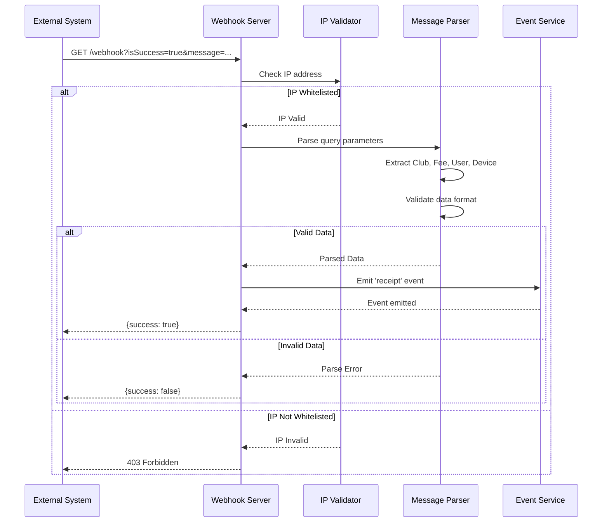
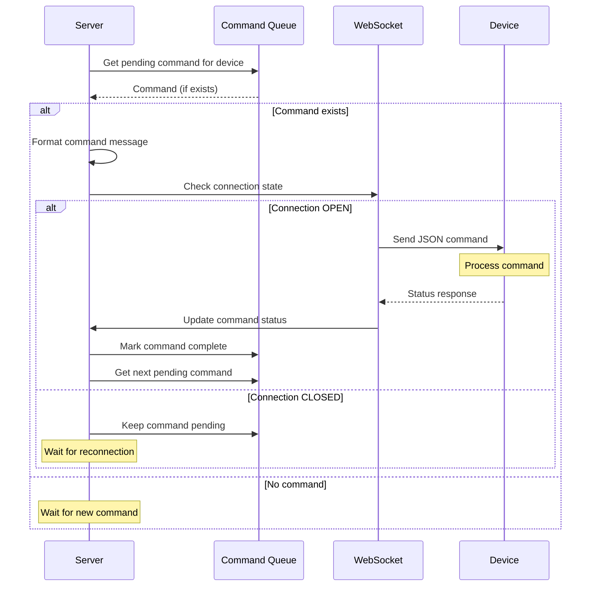
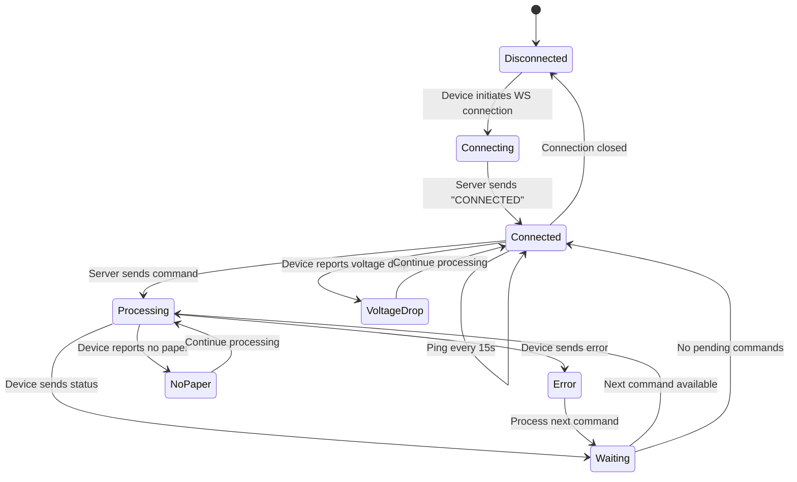
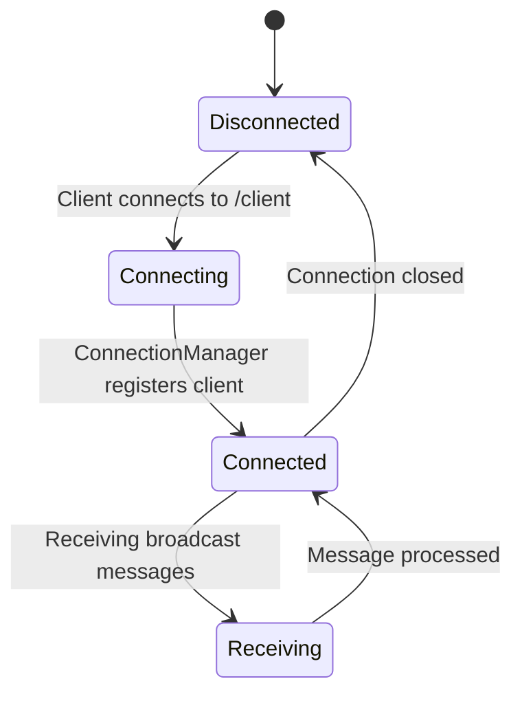
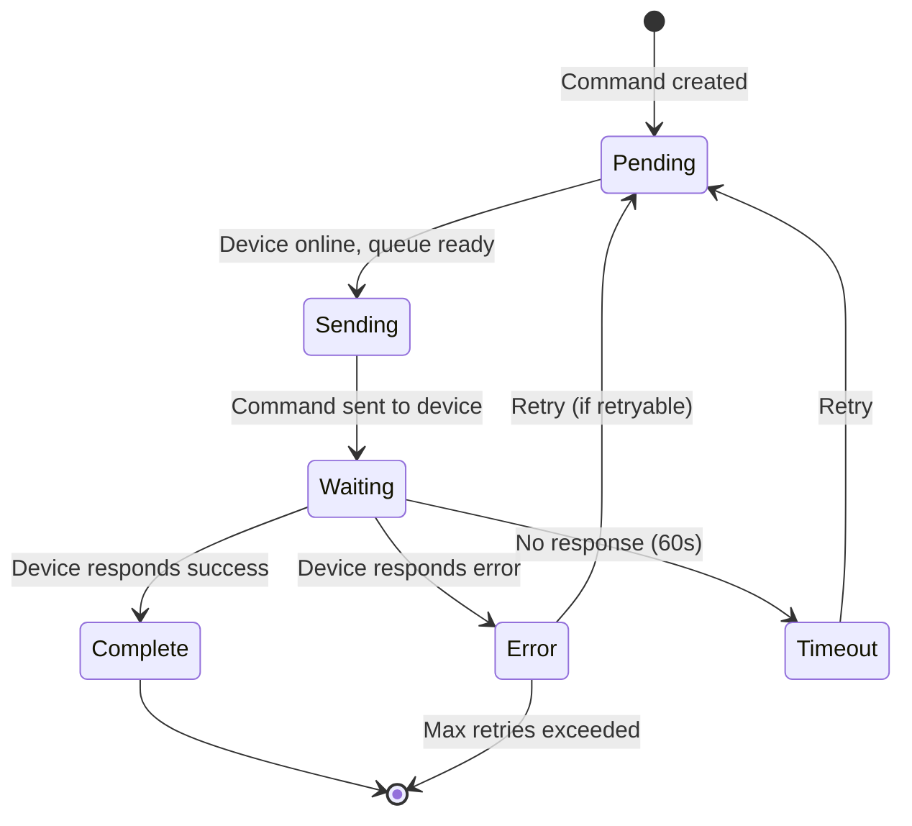
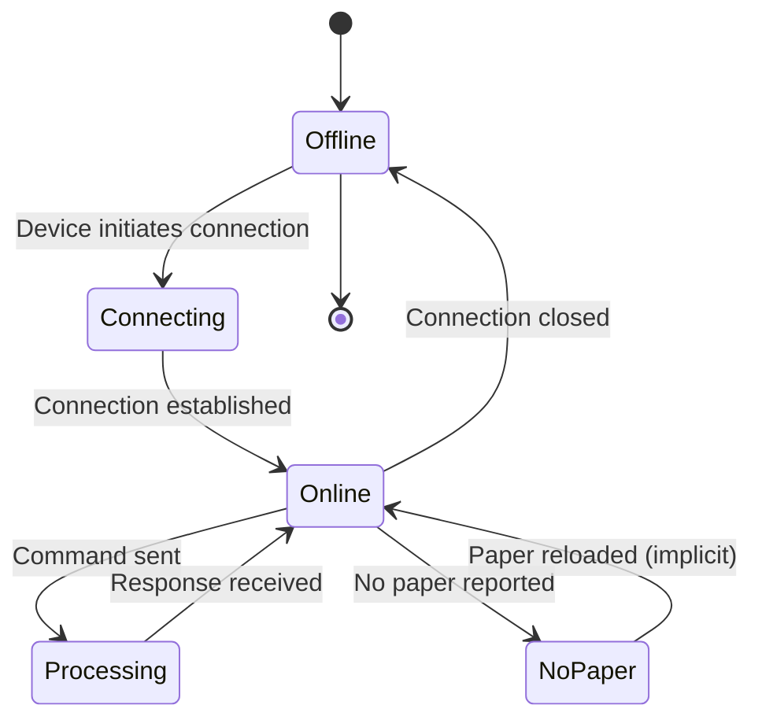

# Communication Protocol Documentation

## Table of Contents

1. [Overview](#overview)
2. [Protocol Architecture](#protocol-architecture)
3. [Webhook to Server Protocol](#webhook-to-server-protocol)
4. [Server to Device Protocol](#server-to-device-protocol)
5. [Device to Server Protocol](#device-to-server-protocol)
6. [Server to Client Protocol](#server-to-client-protocol)
7. [Message Format Specifications](#message-format-specifications)
8. [Connection Lifecycle](#connection-lifecycle)
9. [Error Handling](#error-handling)
10. [Protocol Examples](#protocol-examples)
11. [State Machines](#state-machines)
12. [Timing and Sequencing](#timing-and-sequencing)

---

## Overview

The Receipt System uses multiple communication protocols to facilitate interaction between:
- **External Systems** (via HTTP Webhooks)
- **Server** (Node.js backend)
- **Physical Devices** (Receipt printers via WebSocket)
- **Frontend Clients** (Web dashboard via WebSocket)

All protocols use JSON for data serialization, except webhook which uses URL query parameters.

---

## Protocol Architecture

```
┌─────────────────────────────────────────────────────────────────┐
│                    Communication Flow                            │
└─────────────────────────────────────────────────────────────────┘

External System ──HTTP GET──> Webhook Endpoint ──Event──> Server
                                                              │
                                                              ├──WebSocket──> Physical Device
                                                              │
                                                              └──WebSocket──> Frontend Client
```

### Protocol Stack

```
┌─────────────────────────────────────────┐
│         Application Layer                │
│  (Receipt, Command, Status Messages)    │
├─────────────────────────────────────────┤
│         Transport Layer                 │
│  HTTP (Webhook) | WebSocket (Device/Client) │
├─────────────────────────────────────────┤
│         Network Layer                   │
│  TCP/IP                                  │
└─────────────────────────────────────────┘
```

---

## Webhook to Server Protocol

### Protocol Type: HTTP GET

### Endpoint
```
GET /webhook
```

**Important Note:** This endpoint handles **receipt webhooks only**. Report types (daily, period, cmd, daily-X, spad-naprejenie) are **NOT** handled via webhook. All report types are triggered by the client (frontend) via the authenticated API endpoint `POST /api/devices/:id/command`. This ensures proper authentication and authorization for report generation.

### Request Format

**URL Structure:**
```
GET /webhook?isSuccess={boolean}&message={encoded_string}
```

**Query Parameters:**

| Parameter | Type | Required | Description |
|-----------|------|----------|-------------|
| `isSuccess` | boolean | Yes | Indicates if the transaction was successful |
| `message` | string | Yes | Semicolon-separated key-value pairs containing receipt data |

**Message Format:**
```
Club:{club_name};Zone:{zone_name};MembershipFee:{fee};UserNumber:{user_id};{device_id}
```

**Message Components:**

| Component | Format | Example | Description |
|-----------|--------|---------|-------------|
| `Club` | `Club:{name}` | `Club:Bulgaria` | Location/club name |
| `Zone` | `Zone:{name}` | `Zone:Fitness` | Zone identifier (optional) |
| `MembershipFee` | `MembershipFee:{number}` | `MembershipFee:123.99` | Membership fee amount |
| `UserNumber` | `UserNumber:{id}` | `UserNumber:123456` | User identifier |
| `{device_id}` | `{number}` | `123` | Device ID (can be at end without key) |

### Request Headers

```
x-real-ip: {client_ip_address}
User-Agent: {user_agent}
Host: {server_host}
```

**IP Validation:**
- Server validates `x-real-ip` header against whitelist
- If IP not whitelisted, request is rejected with 403

### Complete Request Example

```
GET /webhook?isSuccess=true&message=Club:Bulgaria;Zone:Fitness;MembershipFee:123.99;UserNumber:123456;123 HTTP/1.1
Host: fiscal.fit.bg
x-real-ip: 213.91.159.250
User-Agent: ExternalSystem/1.0
```

### Response Format

**Success Response:**
```json
{
  "success": true
}
```

**Error Response:**
```json
{
  "success": false
}
```

**HTTP Status Codes:**
- `200 OK` - Request processed (success or failure indicated in body)
- `403 Forbidden` - IP address not whitelisted
- `400 Bad Request` - Invalid query parameters
- `500 Internal Server Error` - Server error

### Request Processing Flow



### Message Parsing Algorithm

```typescript
function parseWebhookMessage(message: string): ReceiptData {
  // Split by semicolon
  const params = message.split(';');
  
  // Extract values
  const club = extractValue(params[0], 'Club');
  const zone = extractValue(params[1], 'Zone'); // Optional
  const membershipFee = parseFloat(extractValue(params[2], 'MembershipFee'));
  const userNumber = extractValue(params[3], 'UserNumber');
  
  // Device ID can be at end without key or in params[4]
  let deviceId = params[4] || getDeviceIdByClub(club);
  
  // Validate
  if (!club || !userNumber || membershipFee <= 0) {
    throw new Error('Invalid message format');
  }
  
  return {
    club,
    zone,
    membershipFee,
    userNumber,
    deviceId,
    amount: 2.76 // Fixed fee
  };
}

function extractValue(param: string, key: string): string {
  return param.split(':')[1]?.trim() || '';
}
```

### Validation Rules

1. **IP Address**: Must be in whitelist
2. **isSuccess**: Must be `true` for processing
3. **Message Format**: Must contain at least `Club`, `MembershipFee`, `UserNumber`
4. **User Number**: Must be at least 2 characters
5. **Membership Fee**: Must be greater than 0
6. **Device ID**: Must exist in system or be derivable from club name

### Error Scenarios

| Scenario | HTTP Code | Response | Server Action |
|----------|-----------|----------|---------------|
| IP not whitelisted | 403 | `{success: false}` | Log unauthorized access |
| Missing parameters | 400 | `{success: false}` | Log error |
| Invalid message format | 200 | `{success: false}` | Log error, don't process |
| User number too short | 200 | `{success: true}` | Ignore (employee), log |
| Membership fee <= 0 | 200 | `{success: true}` | Ignore, log |
| Server error | 500 | `{success: false}` | Log error, alert |

### Report Webhook (Not Implemented)

**Note:** The `POST /webhook/report` endpoint is **NOT implemented**. All report types (daily, period, cmd, daily-X, spad-naprejenie) are triggered by the client (frontend) via the authenticated API endpoint `POST /api/devices/:id/command`, not via webhook. This ensures proper authentication and authorization for report generation.

---

## Server to Device Protocol

### Protocol Type: WebSocket (JSON)

### Connection Endpoint
```
WS /ws/:deviceId
```

### Connection Establishment

**Connection URL:**
```
ws://server:port/ws/123
wss://server:port/ws/123  (SSL)
```

**Connection Flow:**
1. Device initiates WebSocket connection to `/ws/{deviceId}`
2. Device Handler (`device-handler.ts`) receives connection
3. Server validates device ID exists in database (Device model)
4. If invalid, connection closed with code 1008
5. ConnectionManager registers device connection
6. Server sends connection confirmation (string "CONNECTED")
7. ConnectionManager starts ping interval (15 seconds)
8. Device status updated in database (online: true)
9. Server processes any pending commands after 1 second delay
10. ConnectionManager broadcasts device online status to clients

**Connection Confirmation Message:**
```
"CONNECTED"
```
(Note: Sent as plain string, not JSON object)

### Message Types

#### 1. Print Receipt Command

**Purpose:** Instruct device to print a receipt

**Message Format:**
```json
{
  "MessageId": "507f1f77bcf86cd799439011",
  "Seq": "1234",
  "Action": "print",
  "Text": "Ползване на фитнес и спа",
  "Price": "2.76"
}
```

**Field Specifications:**

| Field | Type | Required | Description |
|-------|------|----------|-------------|
| `MessageId` | string (ObjectId) | Yes | Unique command identifier from database |
| `Seq` | string or number | Yes | Receipt sequence number (clubReceiptN). Stored as string in DB, but JSON parsers accept both. |
| `Action` | string | Yes | Must be `"print"` |
| `Text` | string | Yes | Receipt text to print (Bulgarian) |
| `Price` | string or number | Yes | Amount to print on receipt. Stored as string in DB, but JSON parsers accept both. |

**Example:**
```json
{
  "MessageId": "65a1b2c3d4e5f6a7b8c9d0e1",
  "Seq": "1523",
  "Action": "print",
  "Text": "Ползване на фитнес и спа",
  "Price": "2.76"
}
```

**Note:** In receipt implementation, `Seq` and `Price` are stored as strings in MongoDB and sent as strings in JSON. Most JSON parsers will accept both string and number formats, but to match receipt exactly, strings are used.

#### 2. Daily Report Command

**Purpose:** Request daily Z-report from device

**Message Format:**
```json
{
  "MessageId": "507f1f77bcf86cd799439012",
  "Action": "dailyReport"
}
```

**Field Specifications:**

| Field | Type | Required | Description |
|-------|------|----------|-------------|
| `MessageId` | string (ObjectId) | Yes | Unique command identifier |
| `Action` | string | Yes | Must be `"dailyReport"` |

**Example:**
```json
{
  "MessageId": "65a1b2c3d4e5f6a7b8c9d0e2",
  "Action": "dailyReport"
}
```

#### 3. Period Report Command

**Purpose:** Request period report from device

**Message Format:**
```json
{
  "MessageId": "507f1f77bcf86cd799439013",
  "Action": "report",
  "StartDate": "010219",
  "EndDate": "280219"
}
```

**Field Specifications:**

| Field | Type | Required | Description |
|-------|------|----------|-------------|
| `MessageId` | string (ObjectId) | Yes | Unique command identifier |
| `Action` | string | Yes | Must be `"report"` |
| `StartDate` | string | Yes | Start date in format `DDMMYY` |
| `EndDate` | string | Yes | End date in format `DDMMYY` |

**Date Format:**
- Format: `DDMMYY` (6 digits)
- Example: `010219` = January 2, 2019
- Example: `280219` = February 28, 2019

**Example:**
```json
{
  "MessageId": "65a1b2c3d4e5f6a7b8c9d0e3",
  "Action": "report",
  "StartDate": "010120",
  "EndDate": "310120"
}
```

#### 4. Custom Command

**Purpose:** Send custom command to device

**Message Format:**
```json
{
  "Action": "customcmd",
  "MessageId": "507f1f77bcf86cd799439014",
  "CommandId": "2A",
  "Data": "C0C1C2C3"
}
```

**Field Specifications:**

| Field | Type | Required | Description |
|-------|------|----------|-------------|
| `Action` | string | Yes | Must be `"customcmd"` (lowercase) |
| `MessageId` | string (ObjectId) | Yes | Unique command identifier |
| `CommandId` | string | Yes | Custom command identifier (hex) |
| `Data` | string | Optional | Command data (hex string) |

**Note:** Field order matches receipt implementation. JSON is unordered, but this order is used for consistency.

**Common Command IDs:**
- `"2A"` - Generic custom command
- `"45"` - Daily X report
- `"82"` - Spad naprejenie (voltage drop)

**Example:**
```json
{
  "Action": "customcmd",
  "MessageId": "65a1b2c3d4e5f6a7b8c9d0e4",
  "CommandId": "45",
  "Data": "33"
}
```

#### 5. Ping Message

**Purpose:** Keep-alive message to maintain connection

**Message Format:**
```json
{
  "Action": "ping"
}
```

**Field Specifications:**

| Field | Type | Required | Description |
|-------|------|----------|-------------|
| `Action` | string | Yes | Must be `"ping"` |

**Timing:**
- Sent every 15 seconds
- No response expected (implicit pong via connection)

**Example:**
```json
{
  "Action": "ping"
}
```

### Message Sending Rules

1. **Queue Management:**
   - Only one command sent at a time per device
   - Commands queued if device is processing
   - Next command sent after device responds

2. **Connection State:**
   - Commands only sent if WebSocket is OPEN
   - If device offline, command remains pending
   - Pending commands processed when device reconnects

3. **Message Formatting:**
   - All messages must be valid JSON
   - `Seq` and `Price` fields are sent as strings (matching receipt implementation)
   - MessageId must be valid MongoDB ObjectId string

4. **Error Handling:**
   - If send fails, command status remains "pending"
   - Retry on next device connection
   - Log all send failures

### Command Processing Flow



---

## Device to Server Protocol

### Protocol Type: WebSocket (JSON)

### Message Types

#### 1. Status Response (Success)

**Purpose:** Confirm command execution success

**Message Format:**
```json
{
  "MessageId": "507f1f77bcf86cd799439011",
  "Status": "success"
}
```

**Field Specifications:**

| Field | Type | Required | Description |
|-------|------|----------|-------------|
| `MessageId` | string | Yes | Command ID from server command |
| `Status` | string | Yes | Must be `"success"` |

**Server Processing:**
1. Update command status to "complete"
2. Set `tsProcessed` timestamp
3. Process next pending command for device

**Example:**
```json
{
  "MessageId": "65a1b2c3d4e5f6a7b8c9d0e1",
  "Status": "success"
}
```

#### 2. Status Response (Error)

**Purpose:** Report command execution error

**Message Format:**
```json
{
  "MessageId": "507f1f77bcf86cd799439011",
  "Status": "error",
  "MsgData": "Error description",
  "MsgStatus": "Error code"
}
```

**Field Specifications:**

| Field | Type | Required | Description |
|-------|------|----------|-------------|
| `MessageId` | string | Yes | Command ID from server command |
| `Status` | string | Yes | Must be `"error"` |
| `MsgData` | string | Optional | Human-readable error description |
| `MsgStatus` | string | Optional | Error code or status |

**Server Processing:**
1. Update command status to "error"
2. Set `tsProcessed` timestamp
3. Log error with MessageId, MsgData, MsgStatus
4. Process next pending command for device

**Example:**
```json
{
  "MessageId": "65a1b2c3d4e5f6a7b8c9d0e1",
  "Status": "error",
  "MsgData": "Paper jam detected",
  "MsgStatus": "E001"
}
```

#### 3. No Paper Status

**Purpose:** Report paper out condition

**Message Format:**
```json
{
  "Status": "noPaper"
}
```

**Field Specifications:**

| Field | Type | Required | Description |
|-------|------|----------|-------------|
| `Status` | string | Yes | Must be `"noPaper"` |

**Server Processing:**
1. Mark device as "no paper" state
2. Broadcast to all frontend clients
3. Continue processing (device still online)

**Example:**
```json
{
  "Status": "noPaper"
}
```

#### 4. Spad Naprejenie (Voltage Drop) Event

**Purpose:** Report voltage drop condition from device

**Message Format:**
```json
{
  "Action": "spad-naprejenie"
}
```

OR

```json
{
  "Status": "spad-naprejenie"
}
```

**Field Specifications:**

| Field | Type | Required | Description |
|-------|------|----------|-------------|
| `Action` | string | Yes* | Must be `"spad-naprejenie"` (alternative format) |
| `Status` | string | Yes* | Must be `"spad-naprejenie"` (alternative format) |

*Either `Action` or `Status` field can be used to indicate voltage drop event.

**Server Processing:**
1. Log voltage drop alert from device
2. Broadcast to all frontend clients
3. Update device last seen timestamp
4. Continue processing (device still online)

**Example:**
```json
{
  "Action": "spad-naprejenie"
}
```

OR

```json
{
  "Status": "spad-naprejenie"
}
```

#### 5. Ping Response

**Purpose:** Implicit response to ping (connection maintained)

**Behavior:**
- No explicit message sent
- Connection remaining open indicates pong
- If connection closes, device considered offline

### Message Processing Algorithm

```typescript
function handleDeviceMessage(ws: WebSocket, message: string, deviceId: string) {
  let msg: DeviceMessage;
  
  try {
    msg = JSON.parse(message);
  } catch (error) {
    logger.error('Invalid JSON from device', { deviceId, error });
    ws.closed = false; // Reset closed flag
    return;
  }
  
  // Handle ping (no action needed, connection is pong)
  if (msg.Action === 'ping') {
    ws.closed = false;
    return;
  }
  
  // Handle spad-naprejenie (voltage drop) event
  if (msg.Action === 'spad-naprejenie' || msg.Status === 'spad-naprejenie') {
    await handleSpadNaprejenie(deviceId);
    ws.closed = false;
    return;
  }
  
  // Handle status responses
  if (msg.Status) {
    if (msg.Status === 'noPaper') {
      handleNoPaper(deviceId);
      ws.closed = false;
      return;
    }
    
    if (msg.MessageId) {
      if (msg.Status === 'success') {
        await commandService.updateStatus(msg.MessageId, 'complete');
      } else if (msg.Status === 'error') {
        await commandService.updateStatus(msg.MessageId, 'error');
        logger.error('Command error', {
          messageId: msg.MessageId,
          msgData: msg.MsgData,
          msgStatus: msg.MsgStatus
        });
      }
      
      // Process next pending command
      await commandService.processPendingCommands(deviceId);
      ws.closed = false;
    }
  }
}
```

### Response Timing

| Message Type | Expected Response Time | Timeout |
|--------------|----------------------|---------|
| Print Receipt | 2-5 seconds | 60 seconds |
| Daily Report | 5-10 seconds | 120 seconds |
| Period Report | 10-30 seconds | 300 seconds |
| Custom Command | 2-10 seconds | 60 seconds |

### State Management

Device maintains connection state:
- `closed`: Boolean flag indicating if device is processing
- Set to `true` when command sent
- Set to `false` when response received
- Prevents sending multiple commands simultaneously

---

## Server to Client Protocol

### Protocol Type: WebSocket (JSON)

### Connection Endpoint
```
WS /client
```

### Connection Establishment

**Connection URL:**
```
ws://server:port/client
wss://server:port/client  (SSL)
```

**Connection Flow:**
1. Client initiates WebSocket connection to `/client`
2. Client Handler (`client-handler.ts`) receives connection
3. ConnectionManager registers client connection
4. ConnectionManager sends connection confirmation message
5. Client receives real-time updates via broadcasts

**Authentication:**
- No authentication required (matches receipt implementation)
- JWT authentication can be added later via query parameter
- Multiple clients can connect simultaneously

### Message Types

#### 1. Connection Confirmation

**Purpose:** Confirm client connection

**Message Format:**
```json
{
  "type": "info",
  "message": "Connected"
}
```

**Field Specifications:**

| Field | Type | Required | Description |
|-------|------|----------|-------------|
| `type` | string | Yes | Must be `"info"` |
| `message` | string | Yes | Connection message |

**Example:**
```json
{
  "type": "info",
  "message": "Connected"
}
```

#### 2. Receipt Event

**Purpose:** Notify client of new receipt

**Message Format:**
```json
{
  "MessageId": "507f1f77bcf86cd799439011",
  "UnicSaleNum": "1234",
  "action": "print",
  "price": "2.76",
  "user": "123456",
  "location": "Bulgaria"
}
```

**Field Specifications:**

| Field | Type | Required | Description |
|-------|------|----------|-------------|
| `MessageId` | string | Yes | Command ID (MongoDB ObjectId) |
| `UnicSaleNum` | string | Yes | Receipt sequence number (clubReceiptN) |
| `action` | string | Yes | Always `"print"` (lowercase) |
| `price` | string | Yes | Receipt amount (as string) |
| `user` | string | Yes | User number |
| `location` | string | Yes | Location name |

**Note:** This message format matches receipt implementation exactly. The message is sent directly without a `type` wrapper.

**Example:**
```json
{
  "MessageId": "65a1b2c3d4e5f6a7b8c9d0e1",
  "UnicSaleNum": "1523",
  "action": "print",
  "price": "2.76",
  "user": "123456",
  "location": "Bulgaria"
}
```

#### 3. Device Status Update

**Purpose:** Notify client of device connection status change

**Message Format:**
```json
{
  "type": "connect",
  "location": {
    "name": "Bulgaria",
    "device": "123",
    "status": true
  }
}
```

**Field Specifications:**

| Field | Type | Required | Description |
|-------|------|----------|-------------|
| `type` | string | Yes | Must be `"connect"` |
| `location` | object | Yes | Device location info |
| `location.name` | string | Yes | Location name |
| `location.device` | string | Yes | Device ID |
| `location.status` | boolean | Yes | `true` = online, `false` = offline |

**Example (Online):**
```json
{
  "type": "connect",
  "location": {
    "name": "Bulgaria",
    "device": "123",
    "status": true
  }
}
```

**Example (Offline):**
```json
{
  "type": "connect",
  "location": {
    "name": "Bulgaria",
    "device": "123",
    "status": false
  }
}
```

#### 4. No Paper Alert

**Purpose:** Notify client that device has no paper

**Message Format:**
```json
{
  "type": "noPaper",
  "location": {
    "name": "Bulgaria",
    "device": "123",
    "status": true
  }
}
```

**Field Specifications:**

| Field | Type | Required | Description |
|-------|------|----------|-------------|
| `type` | string | Yes | Must be `"noPaper"` |
| `location` | object | Yes | Device location info |
| `location.name` | string | Yes | Location name |
| `location.device` | string | Yes | Device ID |
| `location.status` | boolean | Yes | Always `true` (device still online) |

**Example:**
```json
{
  "type": "noPaper",
  "location": {
    "name": "Bulgaria",
    "device": "123",
    "status": true
  }
}
```

#### 5. Spad Naprejenie (Voltage Drop) Alert

**Purpose:** Notify client that device has detected a voltage drop

**Message Format:**
```json
{
  "type": "spad-naprejenie",
  "location": {
    "name": "Bulgaria",
    "device": "123",
    "status": true
  }
}
```

**Field Specifications:**

| Field | Type | Required | Description |
|-------|------|----------|-------------|
| `type` | string | Yes | Must be `"spad-naprejenie"` |
| `location` | object | Yes | Device location info |
| `location.name` | string | Yes | Location name |
| `location.device` | string | Yes | Device ID |
| `location.status` | boolean | Yes | Always `true` (device still online) |

**Example:**
```json
{
  "type": "spad-naprejenie",
  "location": {
    "name": "Bulgaria",
    "device": "123",
    "status": true
  }
}
```

### Client Message Types (Client → Server)

Clients can send messages to server (future feature):

**Example Structure:**
```json
{
  "type": "receipt",
  "device": "123",
  "data": {
    "amount": 2.76,
    "user": "123456"
  }
}
```

### Broadcasting Rules

1. **Receipt Events:**
   - Broadcasted to all connected clients
   - Sent immediately when receipt command created
   - Includes all receipt metadata

2. **Device Status:**
   - Broadcasted on connection/disconnection
   - Broadcasted on status change
   - Includes full location object

3. **No Paper Alerts:**
   - Broadcasted immediately when received
   - Device remains marked as online
   - Alert persists until paper reloaded

4. **Spad Naprejenie (Voltage Drop) Alerts:**
   - Broadcasted immediately when received from device
   - Device remains marked as online
   - Indicates power supply voltage drop condition

---

## Message Format Specifications

### JSON Schema Definitions

#### Server Command Schema
```json
{
  "$schema": "http://json-schema.org/draft-07/schema#",
  "type": "object",
  "properties": {
    "MessageId": {
      "type": "string",
      "pattern": "^[0-9a-fA-F]{24}$",
      "description": "MongoDB ObjectId"
    },
    "Action": {
      "type": "string",
      "enum": ["print", "dailyReport", "report", "customcmd"]
    },
    "Seq": {
      "type": "string",
      "description": "Required for print action. Receipt sequence number as string (clubReceiptN)"
    },
    "Text": {
      "type": "string",
      "description": "Required for print action"
    },
    "Price": {
      "type": "string",
      "description": "Required for print action. Amount as string (matches receipt implementation)"
    },
    "StartDate": {
      "type": "string",
      "pattern": "^[0-9]{6}$",
      "description": "DDMMYY format, required for report action"
    },
    "EndDate": {
      "type": "string",
      "pattern": "^[0-9]{6}$",
      "description": "DDMMYY format, required for report action"
    },
    "CommandId": {
      "type": "string",
      "description": "Required for customcmd action"
    },
    "Data": {
      "type": "string",
      "description": "Optional for customcmd action"
    }
  },
  "required": ["MessageId", "Action"]
}
```

#### Device Response Schema
```json
{
  "$schema": "http://json-schema.org/draft-07/schema#",
  "type": "object",
  "properties": {
    "MessageId": {
      "type": "string",
      "pattern": "^[0-9a-fA-F]{24}$"
    },
    "Status": {
      "type": "string",
      "enum": ["success", "error", "noPaper", "spad-naprejenie"]
    },
    "MsgData": {
      "type": "string"
    },
    "MsgStatus": {
      "type": "string"
    },
    "Action": {
      "type": "string",
      "enum": ["ping", "spad-naprejenie"]
    }
  }
}
```

#### Client Message Schema
```json
{
  "$schema": "http://json-schema.org/draft-07/schema#",
  "type": "object",
  "properties": {
    "type": {
      "type": "string",
      "enum": ["info", "receipt", "connect", "noPaper", "spad-naprejenie"]
    },
    "message": {
      "type": "string"
    },
    "data": {
      "type": "object"
    },
    "location": {
      "type": "object",
      "properties": {
        "name": { "type": "string" },
        "device": { "type": "string" },
        "status": { "type": "boolean" }
      }
    }
  },
  "required": ["type"]
}
```

---

## Connection Lifecycle

### Device Connection Lifecycle



### Client Connection Lifecycle



**Note**: Authentication is optional and not currently implemented. Token validation can be added in the future.

### Connection States

#### Device States

| State | Description | Actions Available |
|-------|-------------|-------------------|
| `Disconnected` | No WebSocket connection | None |
| `Connecting` | Connection in progress | Wait for confirmation |
| `Connected` | Connection established, idle | Send commands, ping |
| `Processing` | Command sent, waiting response | Wait for status |
| `Waiting` | Response received, checking queue | Process next or idle |
| `Error` | Last command failed | Process next or retry |
| `NoPaper` | Paper out condition | Continue processing |
| `VoltageDrop` | Voltage drop detected | Continue processing, alert clients |

#### Client States

| State | Description | Actions Available |
|-------|-------------|-------------------|
| `Disconnected` | No WebSocket connection | None |
| `Authenticating` | Validating JWT token | Wait for validation |
| `Connected` | Connection established | Receive messages |
| `Receiving` | Processing message | Continue receiving |

---

## Error Handling

### Error Types

#### 1. Webhook Errors

**Invalid IP Address:**
```
HTTP 403 Forbidden
Response: { "success": false }
Server Action: Log unauthorized access attempt
```

**Invalid Message Format:**
```
HTTP 200 OK
Response: { "success": false }
Server Action: Log parse error, don't process
```

**Missing Parameters:**
```
HTTP 400 Bad Request
Response: { "success": false }
Server Action: Log error
```

#### 2. WebSocket Errors

**Connection Errors:**

| Error | Cause | Server Action |
|-------|-------|---------------|
| `ECONNREFUSED` | Device/server unreachable | Log, retry connection |
| `ETIMEDOUT` | Connection timeout | Log, mark device offline |
| `Invalid device ID` | Device not found | Close connection, log |

**Message Errors:**

| Error | Cause | Server Action |
|-------|-------|---------------|
| `Invalid JSON` | Malformed message | Log, ignore message |
| `Missing MessageId` | Status without ID | Log, ignore |
| `Unknown Action` | Invalid action type | Log, ignore |

**Send Errors:**

| Error | Cause | Server Action |
|-------|-------|---------------|
| `WebSocket not open` | Connection closed | Keep command pending |
| `Send timeout` | No response | Mark command error, retry |
| `Network error` | Connection lost | Keep command pending |

### Error Recovery

**Command Retry Logic:**
```typescript
async function sendCommandWithRetry(
  deviceId: string, 
  command: ServerCommand,
  maxRetries: number = 3
): Promise<boolean> {
  for (let attempt = 1; attempt <= maxRetries; attempt++) {
    try {
      const sent = connectionManager.sendToDevice(deviceId, command);
      if (sent) {
        return true;
      }
    } catch (error) {
      logger.warn(`Send attempt ${attempt} failed`, { deviceId, error });
      
      if (attempt < maxRetries) {
        await sleep(1000 * attempt); // Exponential backoff
      }
    }
  }
  
  // All retries failed, keep command pending
  logger.error('All send attempts failed', { deviceId });
  return false;
}
```

**Connection Recovery:**
- Device automatically reconnects on disconnect
- Server processes pending commands on reconnect
- No manual intervention required

---

## Protocol Examples

### Complete Receipt Flow Example

**Step 1: Webhook Request**
```
GET /webhook?isSuccess=true&message=Club:Bulgaria;Zone:Fitness;MembershipFee:123.99;UserNumber:123456;123
```

**Step 2: Server Creates Command**
```json
{
  "_id": "65a1b2c3d4e5f6a7b8c9d0e1",
  "commandType": "receipt",
  "deviceId": "123",
  "amount": "2.76",
  "membershipFee": "123.99",
  "userNumber": "123456",
  "status": "pending"
}
```

**Step 3: Server Sends to Device**
```json
{
  "MessageId": "65a1b2c3d4e5f6a7b8c9d0e1",
  "Seq": "1523",
  "Action": "print",
  "Text": "Ползване на фитнес и спа",
  "Price": "2.76"
}
```

**Step 4: Device Responds**
```json
{
  "MessageId": "65a1b2c3d4e5f6a7b8c9d0e1",
  "Status": "success"
}
```

**Step 5: Server Broadcasts to Clients**
```json
{
  "MessageId": "65a1b2c3d4e5f6a7b8c9d0e1",
  "UnicSaleNum": "1523",
  "action": "print",
  "price": "2.76",
  "user": "123456",
  "location": "Bulgaria"
}
```

### Daily Report Flow Example

**Step 1: Admin Triggers Report (via POST /report)**
```json
{
  "type": "daily",
  "device": "123"
}
```

**Step 2: Server Creates Command**
```json
{
  "_id": "65a1b2c3d4e5f6a7b8c9d0e2",
  "commandType": "dailyReport",
  "deviceId": "123",
  "status": "pending"
}
```

**Step 3: Server Sends to Device**
```json
{
  "MessageId": "65a1b2c3d4e5f6a7b8c9d0e2",
  "Action": "dailyReport"
}
```

**Step 4: Device Responds**
```json
{
  "MessageId": "65a1b2c3d4e5f6a7b8c9d0e2",
  "Status": "success"
}
```

### Error Handling Example

**Step 1: Server Sends Command**
```json
{
  "MessageId": "65a1b2c3d4e5f6a7b8c9d0e3",
  "Seq": "1524",
  "Action": "print",
  "Text": "Ползване на фитнес и спа",
  "Price": "2.76"
}
```

**Step 2: Device Reports Error**
```json
{
  "MessageId": "65a1b2c3d4e5f6a7b8c9d0e3",
  "Status": "error",
  "MsgData": "Paper jam detected",
  "MsgStatus": "E001"
}
```

**Step 3: Server Updates Command**
```json
{
  "_id": "65a1b2c3d4e5f6a7b8c9d0e3",
  "status": "error",
  "tsProcessed": "2024-01-15T10:30:00Z"
}
```

**Step 4: Server Logs Error**
```
ERROR: Command 65a1b2c3d4e5f6a7b8c9d0e3 failed
Device: 123
Error: Paper jam detected (E001)
```

**Step 5: Server Processes Next Command**
- Gets next pending command for device
- Sends if available
- Continues normal flow

---

## State Machines

### Command State Machine



### Device Connection State Machine



---

## Timing and Sequencing

### Timing Requirements

| Operation | Minimum | Typical | Maximum | Timeout |
|-----------|---------|---------|---------|---------|
| Webhook processing | 10ms | 50ms | 200ms | 1s |
| Command creation | 5ms | 20ms | 100ms | 500ms |
| Command send | 1ms | 5ms | 50ms | 100ms |
| Device response (print) | 1s | 3s | 10s | 60s |
| Device response (report) | 5s | 15s | 60s | 300s |
| Ping interval | - | 15s | - | - |
| Connection timeout | - | - | - | 30s |

### Sequencing Rules

1. **Command Sequencing:**
   - Only one command per device at a time
   - Commands processed in FIFO order
   - Next command sent after response received

2. **Event Sequencing:**
   - Webhook events processed immediately
   - Commands queued if device busy
   - Status updates broadcasted immediately

3. **Connection Sequencing:**
   - Device must connect before receiving commands
   - Pending commands processed on connection
   - Ping sent regardless of command state

### Message Ordering Guarantees

- **Webhook → Command:** Guaranteed order (single-threaded processing)
- **Command → Device:** Guaranteed order (queue-based)
- **Device → Server:** Guaranteed order (WebSocket)
- **Server → Client:** Best-effort (broadcast, no ordering guarantee)

---

## Protocol Versioning

### Current Version: 1.0

### Version Identification

**Webhook Protocol:**
- No explicit version
- Backward compatible
- New fields ignored by old servers

**WebSocket Protocol:**
- No explicit version in messages
- Backward compatible
- Unknown fields ignored

### Migration Strategy

1. **Additive Changes:**
   - New optional fields can be added
   - Old clients ignore new fields
   - New clients handle missing fields gracefully

2. **Breaking Changes:**
   - Require protocol version negotiation
   - Support multiple versions simultaneously
   - Deprecate old versions with notice

### Future Enhancements

- Protocol version header in WebSocket handshake
- Message compression
- Binary protocol option
- Batch command support
- Command priority levels

---

## Security Considerations

### Webhook Security

1. **IP Whitelisting:**
   - Only whitelisted IPs can send webhooks
   - IPs validated on every request
   - Failed attempts logged

2. **Input Validation:**
   - All parameters validated
   - SQL injection prevention (N/A for MongoDB)
   - XSS prevention (server-side only)

### WebSocket Security

1. **Device Authentication:**
   - Device ID validated against database
   - Unknown devices rejected
   - Connection attempts logged

2. **Client Authentication:**
   - JWT token required
   - Token validated on connection
   - Expired tokens rejected

3. **Message Validation:**
   - JSON schema validation
   - Type checking
   - Size limits (max 64KB per message)

### Data Protection

1. **Sensitive Data:**
   - User numbers logged but not exposed
   - IP addresses masked in logs
   - Passwords never logged

2. **Transport Security:**
   - WSS (WebSocket Secure) recommended
   - HTTPS for webhooks
   - TLS 1.2+ required

---

## Testing Protocol Compliance

### Test Cases

#### Webhook Tests

1. **Valid Request:**
   ```
   GET /webhook?isSuccess=true&message=Club:Test;MembershipFee:10;UserNumber:123;100
   Expected: 200, {success: true}
   ```

2. **Invalid IP:**
   ```
   GET /webhook?isSuccess=true&message=...
   IP: 1.2.3.4 (not whitelisted)
   Expected: 403
   ```

3. **Invalid Format:**
   ```
   GET /webhook?isSuccess=true&message=Invalid
   Expected: 200, {success: false}
   ```

#### Device Communication Tests

1. **Connection:**
   ```
   Connect: ws://server/ws/123
   Expected: "CONNECTED" message
   ```

2. **Command Send:**
   ```
   Send: Print command
   Expected: Status response within 60s
   ```

3. **Error Handling:**
   ```
   Send: Invalid command
   Expected: Error response or connection close
   ```

### Protocol Compliance Checklist

- [ ] Webhook accepts valid requests
- [ ] Webhook rejects invalid IPs
- [ ] Device connects successfully
- [ ] Commands sent in correct format
- [ ] Device responds with status
- [ ] Errors handled gracefully
- [ ] Clients receive broadcasts
- [ ] Ping/pong maintains connection
- [ ] Queue processes correctly
- [ ] Timeouts handled properly

---

## Appendix

### Message Type Reference

| Type | Direction | Purpose |
|------|-----------|---------|
| `CONNECTED` | Server → Device | Connection confirmation |
| `print` | Server → Device | Print receipt command |
| `dailyReport` | Server → Device | Daily report command |
| `report` | Server → Device | Period report command |
| `customcmd` | Server → Device | Custom command |
| `ping` | Server → Device | Keep-alive |
| `success` | Device → Server | Command success |
| `error` | Device → Server | Command error |
| `noPaper` | Device → Server | Paper out |
| `spad-naprejenie` | Device → Server | Voltage drop event |
| `info` | Server → Client | Connection info |
| `receipt` | Server → Client | Receipt event |
| `connect` | Server → Client | Device status |
| `noPaper` | Server → Client | No paper alert |
| `spad-naprejenie` | Server → Client | Voltage drop alert |

### Field Type Reference

| Field | Type | Format | Example |
|-------|------|--------|---------|
| `MessageId` | string | ObjectId (24 hex) | `"65a1b2c3d4e5f6a7b8c9d0e1"` |
| `Action` | string | Enum | `"print"` |
| `Status` | string | Enum | `"success"` |
| `Seq` | string | Integer as string | `"1523"` |
| `Price` | string | Decimal as string | `"2.76"` |
| `StartDate` | string | DDMMYY | `"010219"` |
| `EndDate` | string | DDMMYY | `"280219"` |
| `CommandId` | string | Hex | `"2A"` |
| `Data` | string | Hex | `"C0C1C2C3"` |

### Common Error Codes

| Code | Description | Action |
|------|-------------|--------|
| `E001` | Paper jam | Check device |
| `E002` | Paper out | Reload paper |
| `E003` | Printer error | Check device |
| `E004` | Communication error | Retry |
| `E005` | Invalid command | Check format |

---

**Document Version:** 1.0  
**Last Updated:** 2024-01-15  
**Maintained By:** Development Team

