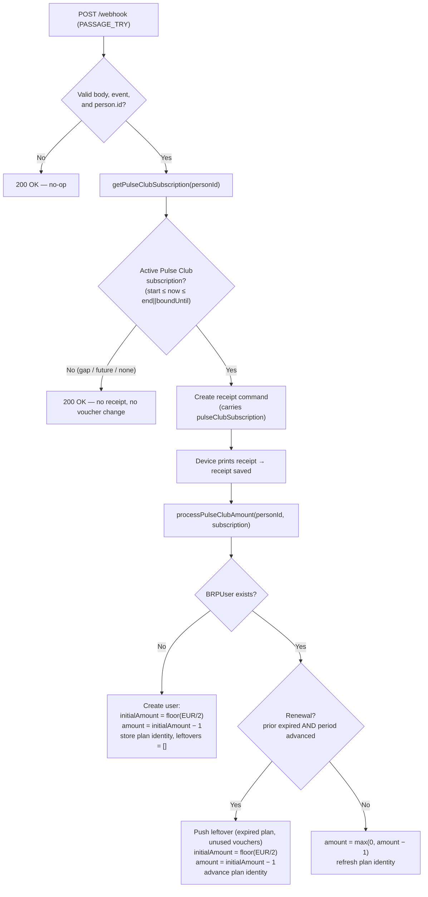

# User Receipts & Subscriptions

In-depth reference for how the system links **BRP customers** to **receipts**, how it tracks
**Pulse Club subscriptions**, and how the **voucher amount lifecycle** works (grant, decrement,
renewal rollover, and per-plan leftovers).

> Scope: backend business logic. For the generic REST/WebSocket contracts see
> [`REST_API.md`](./REST_API.md) and [`COMMUNICATION_PROTOCOL.md`](./COMMUNICATION_PROTOCOL.md). For the
> high-level system layout see [`ARCHITECTURE.md`](./ARCHITECTURE.md).

---

## Table of Contents

1. [Concepts & Glossary](#concepts--glossary)
2. [Data Model](#data-model)
3. [End-to-End Flow](#end-to-end-flow)
4. [Active-Subscription Gating](#active-subscription-gating)
5. [Voucher Amount Lifecycle](#voucher-amount-lifecycle)
6. [Renewal Detection & Rollover](#renewal-detection--rollover)
7. [Per-Plan Leftovers](#per-plan-leftovers)
8. [Worked Examples](#worked-examples)
9. [Edge Cases & Failure Modes](#edge-cases--failure-modes)
10. [REST Exposure](#rest-exposure)
11. [Frontend Display](#frontend-display)
12. [Migrations / Backfill Scripts](#migrations--backfill-scripts)
13. [File Reference Map](#file-reference-map)

---

## Concepts & Glossary

| Term | Meaning |
|------|---------|
| **BRP** | External membership/CRM system. Source of truth for customers and subscriptions. |
| **Person ID (`brpId`)** | Numeric BRP person identifier. Arrives on the webhook as `person.id` and as the receipt `userNumber`. |
| **Customer Number** | Human-facing membership number (`customerNumber`), distinct from `brpId`. |
| **Pulse Club subscription** | A BRP subscription whose product name contains `"pulse club"` (case-insensitive). Only these subscriptions drive receipts and vouchers. |
| **Voucher / amount** | A spendable counter (`amount`) tracked per BRP user. One voucher is consumed per qualifying gym entry. |
| **Grant / initial amount** | The vouchers granted for the current subscription cycle (`initialAmount`). Derived from the product name. |
| **Leftover** | Unused vouchers from a now-expired plan, captured per-plan in `leftovers[]` at renewal. Not spendable. |
| **Renewal / rollover** | When an old plan expires and a new one starts, the old unused vouchers are archived as a leftover and `amount` resets to the new cycle's grant. |

### How the grant is derived

The grant is extracted from the subscription **product name**, which is expected to contain an
amount token like `"990EUR"`. The numeric part is parsed and **halved** (floored):

```
grant (initialAmount) = floor( EUR / 2 )
```

Implemented by `extractAmountFromSubscriptionName()` (regex `/(\d+)EUR/i`) in
[`server/src/services/BRPUserService.ts`](../server/src/services/BRPUserService.ts). If no `EUR`
token is present, the name is considered non-derivable (see [Edge Cases](#edge-cases--failure-modes)).

---

## Data Model

### `BRPUser`

Defined in [`server/src/models/BRPUser.ts`](../server/src/models/BRPUser.ts); typed by `IBRPUser` in
[`server/src/models/types.ts`](../server/src/models/types.ts).

```typescript
interface IBRPUser {
  _id?: string;
  brpId: number;                  // BRP person ID (unique, indexed)
  firstName: string;
  lastName: string;
  user?: string;                  // optional reference
  customerNumber: string;         // membership number (indexed)
  amount: number;                 // spendable vouchers remaining (current cycle)
  initialAmount: number;          // vouchers granted for the current cycle
  subscriptionStartDate?: Date;   // current plan's start (indexed)
  subscriptionBoundUntil?: Date;  // current plan's boundUntil — drives renewal detection (indexed)
  subscriptionId?: number;        // current plan's BRP subscription id (attribution)
  subscriptionName?: string;      // current plan's product name (attribution)
  leftovers?: IBRPLeftover[];     // per-plan archive of unused vouchers
  tsCreated: Date;
}
```

| Field | Role |
|-------|------|
| `amount` | Decreases by 1 per entry; reset to the new grant minus 1 on renewal. Never goes below 0. |
| `initialAmount` | The current cycle's grant. Used to compute "Used = initialAmount − amount". |
| `subscriptionStartDate` / `subscriptionBoundUntil` | The **current plan identity** dates. `boundUntil` is the primary signal for renewal detection. |
| `subscriptionId` / `subscriptionName` | Current plan attribution; copied into a leftover record when the plan is rolled over. |
| `leftovers[]` | History of expired plans' unused vouchers. **Not** spendable, **not** summed into `amount`. |

### `IBRPLeftover` (sub-document, `_id: false`)

```typescript
interface IBRPLeftover {
  subscriptionId?: number;   // expired plan's BRP subscription id
  subscriptionName?: string; // expired plan's product name
  start?: Date;              // expired plan's start
  boundUntil?: Date;         // expired plan's boundUntil
  amount: number;            // unused vouchers carried over from that plan (required)
  recordedAt: Date;          // when the leftover was captured (defaults to now)
}
```

A user can accumulate **multiple** leftover records across multiple expired plans.

### `BRPSubscription` (from BRP)

Fetched via `brpApiService.getCustomerSubscriptions(personId)`. Relevant fields
([`server/src/types/brp-api.ts`](../server/src/types/brp-api.ts)):

| Field | Use here |
|-------|----------|
| `id` | Stored as `subscriptionId` for attribution. |
| `start` | Plan start date. Gates "not started yet"; part of renewal detection. |
| `end` | Primary expiry signal for active gating (`end || boundUntil`). |
| `boundUntil` | Fallback expiry; **primary** renewal trigger when comparing periods. |
| `subscriptionProduct.name` | Pulse Club match + grant extraction (`"…990EUR…"`). |

---

## End-to-End Flow

A gym entry produces a BRP webhook, which (when gated through) creates a receipt command and then
adjusts the user's vouchers.



### Step-by-step

1. **Webhook received** — [`server/src/controllers/webhook-controller.ts`](../server/src/controllers/webhook-controller.ts)
   `handleBRPWebhook()`. Validates body, event type (must be in `RECEIPT_TRIGGER_EVENTS`, e.g.
   `PASSAGE_TRY`), and that `person.id` exists. Any failure → `200 OK` (so BRP does not retry).
2. **Subscription gate** — calls `brpUserService.getPulseClubSubscription(person.id)`. If it returns
   `null` (no **active** Pulse Club plan), the controller logs and returns `200 OK` **without
   creating a receipt**. This is the coverage-gap protection. If the BRP call throws, the controller
   **fails open** and proceeds (subscription remains `undefined`).
3. **Command + receipt** — when gated through, a receipt command is created carrying the resolved
   `pulseClubSubscription`, the device prints, and the receipt is persisted.
4. **Voucher processing** — [`server/src/services/ReceiptService.ts`](../server/src/services/ReceiptService.ts)
   `createReceiptFromCommand()` (~line 546) calls
   `brpUserService.processPulseClubAmount(personId, pulseClubSubscription)` **after** the receipt is
   saved. This is the **only** caller. The passed subscription avoids a duplicate BRP API call.
5. **User create/update** — `processPulseClubAmount()` either creates a new `BRPUser` or updates the
   existing one (decrement or renewal rollover).

> **Important:** `processPulseClubAmount()` is always given an **active** subscription (because both
> the gate and the internal fallback use `findActivePulseClubSubscription`). This guarantees a
> future-dated plan can never trigger a premature rollover.

---

## Active-Subscription Gating

A receipt — and any voucher change — only happens when the member has a **currently active** Pulse
Club subscription. Implemented in [`server/src/services/BRPUserService.ts`](../server/src/services/BRPUserService.ts):

```typescript
const isPulseClub = (sub) =>
  sub.subscriptionProduct.name.toLowerCase().includes('pulse club');

// Active = started AND not yet expired. Expiry = end, falling back to boundUntil.
const isSubscriptionActive = (sub, now) => {
  if (sub.start && new Date(sub.start) > now) return false; // future plan
  const expiryRaw = sub.end || sub.boundUntil;
  if (!expiryRaw) return true;                              // ongoing, no expiry
  return new Date(expiryRaw) >= now;
};

const findActivePulseClubSubscription = (subscriptions, now = new Date()) =>
  subscriptions.find((sub) => isPulseClub(sub) && isSubscriptionActive(sub, now));
```

Active window: **`start ≤ now ≤ (end || boundUntil)`**.

| Situation | `findActivePulseClubSubscription` | Result |
|-----------|-----------------------------------|--------|
| Plan currently active | returns the plan | receipt printed, vouchers processed |
| Old plan ended, new plan starts in 2 weeks (gap) | `undefined` | **no receipt, no voucher change** |
| Plan starts in the future only | `undefined` | no receipt |
| No Pulse Club plan at all | `undefined` | no receipt |

Both entry points use this helper, so behavior is consistent:
- `getPulseClubSubscription()` — used by the webhook gate.
- the internal fallback inside `processPulseClubAmount()` (when no subscription was passed in).

> **Field-semantics note:** expiry uses `end || boundUntil`. If BRP's Pulse Club product expresses
> access-end via a different field (e.g. `expirationDay`), adjust `isSubscriptionActive` accordingly.

---

## Voucher Amount Lifecycle

`amount` only ever **decreases** within a cycle and is **reset** on renewal. There is **no
exhaustion-based auto-refill** — a member at `amount = 0` stays at `0` until an actual renewal.

### New user (`createUserForSubscription`)

```
extracted      = parseEUR(productName)        // e.g. 990
initialAmount  = floor(extracted / 2)         // 495
amount         = max(0, initialAmount - 1)    // 494 (this entry consumes one)
leftovers      = []
plan identity  = { subscriptionId, subscriptionName, start, boundUntil }
```

If `extracted` is `null` (no `EUR` token), **no user is created** and the entry is skipped (warning
logged).

### Existing user — normal entry (no renewal)

```
amount = max(0, amount - 1)         // decrement, floored at 0
initialAmount = unchanged
plan identity refreshed (id/name/start/boundUntil) to the active subscription
```

### Existing user — renewal (`computeAmountUpdate` → rollover)

```
leftover  = { expired plan identity, amount: max(0, oldAmount), recordedAt: now }  // archived
initialAmount = floor(EUR_new / 2)            // new cycle grant
amount        = max(0, initialAmount - 1)     // new grant minus this entry
plan identity advanced to the new subscription
```

The DB write is a single `findOneAndUpdate`: always `$set` the fields, and `$push` the leftover
**only** on a rollover.

---

## Renewal Detection & Rollover

Detection is **date-based** and **idempotent**. From `detectRenewal()`:

```typescript
const detectRenewal = (existingUser, newStart, newBoundUntil, now) => {
  const storedStart = existingUser.subscriptionStartDate;
  const storedBoundUntil = existingUser.subscriptionBoundUntil;
  if (!storedBoundUntil || now <= storedBoundUntil) return false; // need a baseline + prior expired
  return (
    (!!newStart && !!storedStart && newStart > storedStart) ||
    (!!newBoundUntil && newBoundUntil > storedBoundUntil)        // period advanced
  );
};
```

A renewal requires **all** of:

1. **A baseline exists** — `subscriptionBoundUntil` is stored (legacy users without it are seeded by
   the backfill, see below).
2. **Prior period expired** — `now > storedBoundUntil`.
3. **Period advanced** — the new plan's `start` is later than the stored start, **or** the new plan's
   `boundUntil` is later than the stored `boundUntil`.

Because the plan identity is **advanced** to the new subscription on every processed entry, once the
new period is persisted the same entry will no longer satisfy condition (2)/(3) — so a renewal rolls
over **exactly once**. The active-gating guarantee (subscription is always currently active) means a
future plan cannot pre-trigger this.

**Renewal with non-derivable new grant:** if a renewal is detected but the new product name has no
`EUR` token, the code logs a warning and **falls back to a normal decrement** (no leftover, no
reset). `initialAmount` and the cycle are left intact.

---

## Per-Plan Leftovers

- Captured **only** at the moment of renewal, from the **stored** (expired) plan identity.
- Stored **per plan** — multiple expired plans accumulate multiple records.
- `amount` in a leftover is `max(0, oldAmount)` — the unused vouchers of the expired cycle.
- **Never** added back into the spendable `amount`; they are an archive/audit trail only.
- The backfill does **not** reconstruct historical leftovers — it only seeds the current baseline.

---

## Worked Examples

Assume product `"Pulse Club 990EUR"` → grant = `floor(990/2) = 495`.

### Example 1 — first-ever entry

New user created: `initialAmount = 495`, `amount = 494`, `leftovers = []`.

### Example 2 — second entry, same cycle

`amount: 494 → 493`. `initialAmount` unchanged. No leftover.

### Example 3 — entries after exhaustion

Member reaches `amount = 0`. Further entries within the same cycle keep `amount = 0` (no refill).

### Example 4 — renewal rollover

Old plan `boundUntil = 2026-01-31`, member had `amount = 12` unused. New plan
`"Pulse Club 990EUR"` with `start = 2026-02-01`, `boundUntil = 2027-01-31`. First entry on/after
`2026-02-01`:

- `leftovers` gains `{ subscriptionId/name/start/boundUntil = old plan, amount: 12, recordedAt: now }`.
- `initialAmount = 495`, `amount = 494`.
- plan identity advanced to the new subscription. Subsequent entries just decrement from 494.

### Example 5 — coverage gap (no receipt)

Old plan ended `2026-01-31`; new plan starts `2026-02-14`. An entry on `2026-02-05` finds **no
active** Pulse Club subscription → `200 OK`, **no receipt**, **no voucher change**, **no rollover**.
The rollover only happens on the first entry on/after `2026-02-14`.

---

## Edge Cases & Failure Modes

| Case | Behavior |
|------|----------|
| BRP API not configured (`isConfigured() === false`) | `processPulseClubAmount` and `getPulseClubSubscription` log a warning and no-op/return `null`. |
| Subscription check throws in the webhook | **Fail open**: receipt creation proceeds, `pulseClubSubscription` stays `undefined` (the service then refetches and re-gates). |
| `processPulseClubAmount` throws | Caught and logged; **never** rethrown — the webhook/receipt still succeeds. |
| Product name has no `EUR` token (new user) | No user created; entry skipped (warning). |
| Product name has no `EUR` token (renewal) | Falls back to a normal decrement; no rollover. |
| Legacy user without `subscriptionBoundUntil` | No renewal can be detected until a baseline is seeded (run the backfill). Until then, entries just decrement and the identity is refreshed on the next processed entry. |
| `amount` would go below 0 | Floored at 0 via `Math.max(0, …)`. |

---

## REST Exposure

The receipts endpoints expose a **hand-picked subset** of `BRPUser` fields as `receipt.user`
([`server/src/controllers/receipt-controller.ts`](../server/src/controllers/receipt-controller.ts)):

```jsonc
"user": {
  "brpId": 123456,
  "firstName": "…",
  "lastName": "…",
  "customerNumber": "…",
  "amount": 494,                 // Remain Vouchers
  "initialAmount": 495,          // Initial Vouchers
  "subscriptionStartDate": "…",  // ISO string
  "tsCreated": "…"
}
```

The new fields — `leftovers`, `subscriptionId`, `subscriptionName`, `subscriptionBoundUntil` — are
**intentionally not exposed** by the API. Surfacing leftovers would require extending this mapping
(and the frontend `Receipt.user` type) and is out of scope. See [`REST_API.md`](./REST_API.md) for
the full endpoint contracts.

---

## Frontend Display

The receipts table ([`frontend/src/components/receipts/ReceiptTable.tsx`](../frontend/src/components/receipts/ReceiptTable.tsx))
shows, per receipt's linked user:

- **Remain Vouchers** = `user.amount`
- **Initial Vouchers** = `user.initialAmount`
- **Used Vouchers** = `initialAmount − amount` (per cycle, **not** cumulative across cycles)
- **Subscription Start** = `user.subscriptionStartDate`

After a renewal, Remain resets to `newGrant − 1` and Used resets to `1` for the new cycle. Leftovers
from prior plans are stored but **not** displayed (not exposed by the API).

---

## Migrations / Backfill Scripts

All live in [`server/src/services/BRPUserService.ts`](../server/src/services/BRPUserService.ts) with
runner scripts under [`server/src/scripts/`](../server/src/scripts/). They are **one-off** and
idempotent where noted.

| Method | Purpose |
|--------|---------|
| `backfillSubscriptionBaseline()` | Seeds the current plan identity (`subscriptionId`, `subscriptionName`, `subscriptionBoundUntil`, missing `subscriptionStartDate`, empty `leftovers`) for existing users. **Never** touches `amount`/`initialAmount`. Required so renewal detection works for legacy users. |
| `backfillInitialAmounts()` | Historical: recompute `initialAmount`/`amount` from current subscription names. |
| `backfillHalvedInitialAmounts()` | Historical: halve previously stored amounts. |

### Running `backfillSubscriptionBaseline` (run once, after deploy)

Local (dev, from `server/`, uses local `.env`):

```bash
npx ts-node-dev --transpile-only src/scripts/backfillSubscriptionBaseline.ts
```

Heroku (prod) — devDependencies are pruned, so run the compiled JS:

```bash
heroku run "node server/dist/scripts/backfillSubscriptionBaseline.js" -a pulse-fitness
```

It makes one BRP API call per user, only fills missing fields, and is safe to re-run.

---

## File Reference Map

| Concern | File |
|---------|------|
| Webhook entry + subscription gate | [`server/src/controllers/webhook-controller.ts`](../server/src/controllers/webhook-controller.ts) |
| Receipt creation → voucher trigger | [`server/src/services/ReceiptService.ts`](../server/src/services/ReceiptService.ts) (`createReceiptFromCommand`, ~line 546) |
| Voucher business logic (gating, grant, rollover) | [`server/src/services/BRPUserService.ts`](../server/src/services/BRPUserService.ts) |
| BRP user model | [`server/src/models/BRPUser.ts`](../server/src/models/BRPUser.ts) |
| Types (`IBRPUser`, `IBRPLeftover`) | [`server/src/models/types.ts`](../server/src/models/types.ts) |
| BRP API types (`BRPSubscription`, …) | [`server/src/types/brp-api.ts`](../server/src/types/brp-api.ts) |
| BRP API client | [`server/src/services/BRPApiService.ts`](../server/src/services/BRPApiService.ts) |
| REST mapping of `receipt.user` | [`server/src/controllers/receipt-controller.ts`](../server/src/controllers/receipt-controller.ts) |
| One-off baseline backfill runner | [`server/src/scripts/backfillSubscriptionBaseline.ts`](../server/src/scripts/backfillSubscriptionBaseline.ts) |
| Frontend receipts table | [`frontend/src/components/receipts/ReceiptTable.tsx`](../frontend/src/components/receipts/ReceiptTable.tsx) |

---

## Heroku Backfill Command

Run the one-off subscription-baseline backfill on production (Heroku app: `pulse-fitness`). The
deploy's `heroku-postbuild` compiles the script to `server/dist/scripts/backfillSubscriptionBaseline.js`.

**Run it (attached one-off dyno):**

```bash
heroku run "node server/dist/scripts/backfillSubscriptionBaseline.js" -a pulse-fitness
```

**Long runs (detached + tail logs):** one BRP API call per user, so for a large member base run it
detached and follow the logs:

```bash
heroku run:detached "node server/dist/scripts/backfillSubscriptionBaseline.js" -a pulse-fitness
heroku logs --tail -a pulse-fitness | grep BACKFILL_SUBSCRIPTION_BASELINE
```

**Notes:**
- Deploy first — the compiled file only exists after a deploy. Verify with
  `heroku run "ls server/dist/scripts" -a pulse-fitness`.
- Uses production config vars automatically (Mongo URI, BRP API creds).
- Safe to re-run: idempotent (only fills missing identity fields, never touches `amount`/`initialAmount`).
- The final log line reports `total`, `updated`, `skipped`, `failed`.
